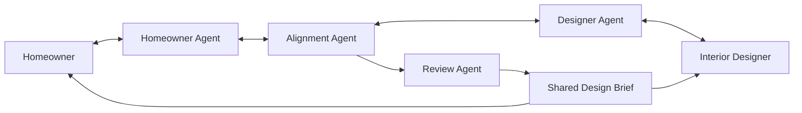

# Design Inspiration Agents

> Status: Early problem framing and working proposal. This document is intended to help the team align before implementation; the architecture and scope may change after user research and prototyping.

## Problem Statement

Homeowners planning a renovation often struggle to communicate their design preferences using words alone. They may collect many reference images from websites and social media, but those images do not always explain *what* they like: the colour palette, material, lighting, layout, furniture, atmosphere, or some combination of these.

Interior designers must manually review these references, interpret incomplete or conflicting comments, and translate them into a practical design direction. The designer and homeowner may believe they agree while holding different interpretations of terms such as "minimalist", "warm", or "modern". This misalignment can lead to repeated clarification, unsuitable early concepts, additional revisions, and wasted time for both parties.

The challenge is therefore not only to recommend attractive images. It is to help both sides progressively express, clarify, compare, and confirm their understanding until they can agree on an actionable design brief.

## Target Users

- **Homeowners**, who need help turning visual inspiration and informal language into clear preferences.
- **Interior designers**, who need an efficient way to understand preferences, introduce professional constraints, and identify unresolved decisions.

## Working Idea

We propose a two-sided, multi-agent design alignment assistant. Instead of acting as a simple messenger, the system actively interviews both parties and maintains a shared representation of the project.

- A **Homeowner Agent** analyses inspiration images and asks focused questions to clarify style, colour, material, spatial, functional, and budget preferences.
- A **Designer Agent** captures professional recommendations, feasibility constraints, and trade-offs, then explains them in homeowner-friendly language.
- An **Alignment Agent** compares both sides, identifies ambiguity or conflict, and selects the next useful question.
- A **Review Agent** checks confidence, source attribution, privacy concerns, and unsupported or unsafe claims before results are presented.

The questioning strategy is inspired by narrowing-down games such as Akinator: each question should reduce uncertainty rather than asking the user to describe everything at once.

## Proposed User Journey

1. The homeowner uploads a small set of inspiration images and answers an initial questionnaire.
2. The system extracts possible preferences such as styles, colours, materials, lighting, layout, and atmosphere.
3. The Homeowner Agent asks targeted questions about uncertain or conflicting observations.
4. The designer reviews the structured preference profile and adds practical constraints or alternative suggestions.
5. The Designer Agent structures this feedback and highlights decisions that require homeowner input.
6. The Alignment Agent iterates between both sides until major preferences and constraints are confirmed.
7. The system produces several explainable design directions for comparison.
8. Both parties review the result and approve an editable, shared design brief.

## Initial MVP Scope

The first prototype should demonstrate the complete alignment loop while keeping the domain small enough to build and evaluate during the hackathon.

### In scope

- One residential room type initially.
- Uploading approximately 3–10 inspiration images.
- Multimodal extraction of design attributes.
- A short sequence of adaptive clarification questions.
- Structured homeowner preference profiles.
- Designer feedback and feasibility constraints.
- Detection of missing or conflicting requirements.
- Up to three explainable design directions or mood boards.
- A final editable design brief containing:
  - preferred styles and keywords;
  - colour and material preferences;
  - functional requirements;
  - liked and rejected references;
  - confirmed constraints and trade-offs;
  - unresolved decisions requiring human discussion.

### Out of scope for the initial prototype

- Structural, electrical, regulatory, or safety-critical renovation advice.
- Construction drawings or exact cost quotations.
- Automatic purchasing, supplier contact, or renovation commitments.
- Large-scale scraping of websites or social media.
- Training a new large foundation model.
- Replacing the professional judgement of an interior designer.

## Why an Agentic Approach?

A single prompt assumes that users can clearly state their requirements. In practice, the main problem is that important preferences are implicit, incomplete, or contradictory. An agentic workflow can decide what information is missing, ask the next useful question, use tools to retrieve approved references, compare the two parties' views, and escalate uncertain decisions to a human.

The potential differentiation is not a single foundation model. It is the combination of:

- two-sided requirement elicitation;
- adaptive, information-seeking questions;
- multimodal preference extraction;
- explicit conflict detection;
- a shared and traceable preference representation;
- human approval at consequential decision points; and
- measurable improvement in alignment efficiency.

## Preliminary Success Measures

The exact baselines will be established through initial user testing. Candidate measures include:

- time required to produce an initial design brief;
- homeowner–designer agreement on the final preference profile;
- number of questions needed to reach an acceptable confidence level;
- first-round concept acceptance rate;
- reduction in major revision cycles;
- rate of AI outputs corrected or rejected by a human; and
- usability ratings from homeowners and designers.

A possible prototype target is to reach at least 80% independent agreement on the resulting design brief using no more than 10 clarification questions. This target must be validated during the pilot rather than treated as an established benchmark.

## Data and Safety Considerations

- Use user-uploaded, licensed, approved, or project-created reference material.
- Do not assume that images found online are free to reuse.
- Obtain consent before retaining uploaded images beyond an active session.
- Minimise collected personal information and support deletion.
- Preserve reference-source information where available.
- Mark low-confidence or conflicting recommendations for human review.
- Require professional verification of structural, regulatory, pricing, and product-availability information.
- Never allow the system to make purchases or external commitments automatically.

## Technical Direction (Tentative)

The implementation should keep foundation models interchangeable and evaluate them by task quality, latency, and cost rather than parameter count alone.

Possible AWS components include:

- Amazon Bedrock for multimodal understanding and language generation;
- Amazon S3 for controlled image and document storage;
- Amazon OpenSearch Service or a Bedrock Knowledge Base for approved-reference retrieval;
- AWS Lambda and Step Functions for agent and workflow orchestration; and
- application-level logging, validation, retry limits, and access controls.

These are working choices, not final commitments.

## Open Questions

- Which room type should the MVP support first?
- What questions do designers currently ask during the first client meeting?
- Which misunderstandings cause the most redesign work?
- How should design preferences and confidence be represented?
- How should the next clarification question be selected?
- What constitutes sufficient alignment to stop asking questions?
- Which reference dataset can be used legally and reliably?
- How will we recruit representative homeowners and designers for evaluation?
- Should the first prototype generate new visuals, retrieve references, or do both?
- Which model offers the best quality/cost/latency trade-off on our test cases?

## Suggested Workstreams

- User research and design-brief schema.
- Homeowner interview and image-understanding flow.
- Designer feedback and constraint flow.
- Alignment logic and shared preference state.
- Retrieval, concept generation, and review controls.
- Frontend experience and AWS deployment.
- Evaluation dataset, metrics, and demo scenario.

## Collaboration Workflow

- Keep `main` stable and avoid direct feature development on it.
- Create focused branches such as `feature/homeowner-agent`, `feature/designer-agent`, or `feature/alignment-engine`.
- Open small pull requests and request at least one teammate review.
- Link implementation work to GitHub Issues where possible.
- Never commit `.env` files, API keys, credentials, private user images, or other secrets.

## Current Project Status

The team has selected the Design Inspiration problem and agreed to explore a two-sided agent architecture. The next step is to validate the real homeowner–designer workflow, define the shared design-brief schema, select an MVP room type, and create a small evaluation set before committing to a detailed implementation.
