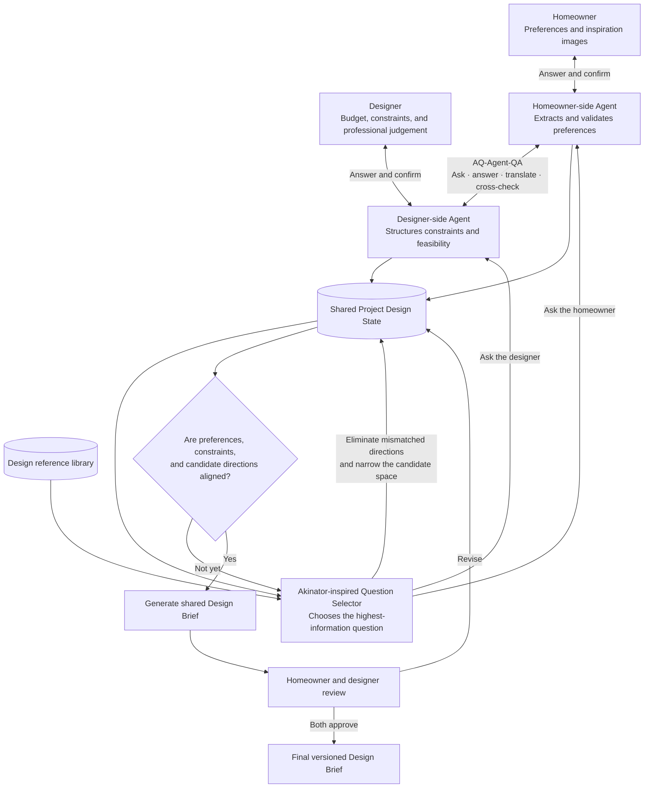

# AlignSpace — Design Inspiration Agents

## Project summary

**AlignSpace** is a reference-library-driven, two-sided requirements-alignment system for Singapore homeowners and interior-design SMEs. Rather than generating a design from a single prompt, it progressively turns inspiration images, informal preferences, designer feedback, and real-world constraints into a shared, actionable living-room design brief.

The system maintains one versioned **Project Design State** as its source of truth. It clearly separates confirmed requirements, AI inferences, rejected ideas, unresolved conflicts, and professional constraints, with every change linked to its source. After each interaction, hybrid retrieval analyses the remaining design space so the agents can ask the highest-value question, compare genuinely different directions, or focus on feasible details.

A deterministic readiness score guides the workflow through **Explore, Clarify, Focus, and Commit**. The final brief records agreed preferences, accepted reference elements, constraints, open risks, and approval history. The MVP targets alignment within 10 clarification questions while keeping structural, regulatory, pricing, and other consequential decisions under human review.

## Why this exists

Homeowners often say things such as “warm modern” or “hotel-like,” but the same words can mean different colours, materials, layouts, lighting, or price points. Designers spend time reverse-engineering what a client likes from unrelated images, then repeat early concepts when expectations were not actually aligned.

AlignSpace does not replace a designer and does not produce construction advice. Its job is to reduce ambiguity before concept design begins.

## MVP promise

> From 3–10 inspiration images to a mutually approved living-room design brief in one guided session, with every AI inference labelled, editable, and linked to evidence.

## Hackathon operating brief

This section captures organiser guidance from the **ShowMeYourAgent - NUS ISS** Slack workspace and the briefing deck shared there. It was last reconciled on **7 September 2026 (Singapore time)**. Treat newer organiser announcements in Slack as authoritative if they conflict with this summary.

### What must be delivered

- **Shortlisting deadline:** 28 September 2026 at **9:00am SGT**.
- **Finale:** shortlisted teams must be ready for a face-to-face demo on 10 October 2026 at **8:30am SGT**.
- Post the shortlisting entry in `#submission`. Ignore `#round1-submission`, which organisers identified as an internal test channel. `#final-submission` is only for finalist updates.
- The Slack post itself should be text and include the team code, project name, a judge-accessible GitHub repository URL, and a YouTube or other view/download URL for the MP4 demo. Do **not** upload the video directly to the submission channel.
- Also prepare the PDF write-up and deployment evidence or URL. The briefing deck describes a 30-minute video; verify this unusually long duration against the latest Slack announcement before recording.
- Incomplete or inaccessible submissions may be rejected. Test repository, video, and deployment links from a signed-out browser before posting.

### Build and deployment constraints

- Any programming language, agent framework, and local development tool may be used. The organiser explicitly allows teams to code a custom agent.
- Development may use the team's own services and AI tools, but the version assessed for the competition must deploy on the organiser-provided **AWS Lightsail** environment.
- The organiser plans to expose LLM prompting through a team API in JSON format rather than provide direct Bedrock access. The briefing names **Claude Sonnet 4.5** behind that API; connection details and the team API key are distributed separately.
- Shortlisting support is stated as **USD 100 of AWS credit per team** and **USD 20 of Kiro credit per participant**. Usage beyond the provided AWS limit may pause the account and affect the entry.
- Teams may use their own datasets or RAG documents. When real SME data, business rules, or third-party integrations are unavailable, the organiser allows clearly stated assumptions, mock data, mock company APIs, and public APIs.

### What the proposal and judging should demonstrate

- Public-category teams choose one business problem from the proposal form and may narrow a vague statement to a specific industry and target group. SME-category teams propose their own business problem; organisers can help assign one when needed.
- Work can begin once the problem is selected. The implementation may differ from the initial proposal, but the final agent must still address the business goal.
- Explain the chosen scope and assumptions, justify the method, and make the business value explicit.
- The published rubric covers: goal and scope; architecture and reasoning loop; tool use and integration; autonomy and human-in-the-loop controls; safety, security and guardrails; observability and evaluation; and platform/tooling usage.
- For AlignSpace, the strongest evidence is a complete trace from ambiguous references to an approved brief, including explicit state and memory, typed tool boundaries, human approval gates, prompt-injection resistance, least privilege, logs, and both golden-path and adversarial evaluations.

### Slack channel map

| Channel | Use |
|---|---|
| `#tech-support` | AWS and other technical issues |
| `#solutioning` | Approach, architecture, and solution brainstorming |
| `#admin-related` | Organiser or mentor questions |
| `#submission` | Shortlisting deliverables due 28 September |
| `#final-submission` | Finalist-only updated artifacts |

All announcements, support, and submission changes are communicated through Slack, so this repository summary should be rechecked before packaging.

## Core workflow

1. Homeowner creates a project, gives consent, uploads references, and supplies room/budget context.
2. Vision analysis proposes attributes and evidence regions without treating guesses as facts.
3. The Interview Agent asks at most 10 adaptive questions chosen for expected uncertainty reduction.
4. The Designer Agent structures professional constraints and explains trade-offs plainly.
5. The Alignment Agent identifies agreement, conflict, and missing decisions.
6. The Review Agent checks provenance, confidence, safety, and brief completeness.
7. Both people edit and explicitly approve a versioned design brief.

## Simplified system architecture

The architecture combines two complementary ideas:

- **AQ-Agent-QA:** the homeowner-side and designer-side agents question, answer, translate, and cross-check each other's structured understanding. They may reason from confirmed state, but any unresolved or consequential assumption is returned to the relevant human for confirmation.
- **Akinator-inspired questioning:** instead of following a fixed questionnaire, the system selects the next question by expected information gain. Each answer should eliminate incompatible design directions, resolve an important conflict, or narrow the reference set.
- **Controlled convergence:** the loop continues until preferences, professional constraints, and retrieved design directions are sufficiently aligned. The output is released only after both people approve the same versioned brief.

## Implemented backend

The local backend now implements the shared-state and approval workflow with FastAPI, LangGraph, and SQLite. It uses deterministic image fixtures for network-free testing; real image upload, a production identity provider, the competition JSON LLM API, AWS deployment, and design visualisation remain separate integration stages. See the [backend runbook](README.backend.md) for setup, API scope, and verification commands.

## Repository guide

For contributors and other coding models, start with the [Chinese project handoff](docs/15-project-handoff.zh-CN.md). It distinguishes the tested backend from the unfinished authentication/frontend worktree and records the current tasks and API contracts.

| File | Purpose |
|---|---|
| [Backend runbook](README.backend.md) | Implemented local FastAPI/LangGraph backend, API usage, tests, and current limitations |
| [Frontend runbook](README.frontend.md) | React + TypeScript client setup, authenticated local demo, tests, and boundaries |
| [Official hackathon briefing](docs/references/showmeyouragent-hackathon-briefing-2026-09-06.pdf) | Organiser-provided rules, rubric, dates, submission format, and AWS/Kiro support |
| [Official context](docs/00-official-context.md) | Verified event facts vs team assumptions |
| [Product requirements](docs/01-product-requirements.md) | PRD, scope, users, stories, acceptance criteria |
| [Research plan](docs/02-user-research-plan.md) | Interviews, tests, consent, synthesis |
| [Experience specification](docs/03-experience-spec.md) | Flows, screens, states, copy |
| [Agent system design](docs/04-agent-system-design.md) | Agent responsibilities and orchestration |
| [Technical architecture](docs/05-technical-architecture.md) | AWS design, deployment, observability |
| [Contracts](docs/06-data-and-api-contracts.md) | Domain model and API boundaries |
| [Safety and security](docs/07-safety-privacy-security.md) | Threat model, privacy, controls |
| [Evaluation](docs/08-evaluation-plan.md) | Offline, human, business, red-team tests |
| [Delivery plan](docs/09-delivery-roadmap.md) | Three-week plan and backlog |
| [Business case](docs/10-business-case.md) | Value, adoption, pricing hypothesis, pilot |
| [Demo and pitch](docs/11-demo-and-pitch.md) | Script, fallback, judge Q&A |
| [Submission checklist](docs/12-submission-checklist.md) | Evidence and artifact checklist |
| [Decision log](docs/13-decision-log.md) | Decisions, assumptions, unresolved choices |
| [Design brief schema](schemas/design-brief.schema.json) | Machine-readable shared state |
| [Agent prompts](prompts/README.md) | Versioned behavioural contracts |
| [Demo brief](examples/project-haven.design-brief.json) | Schema-valid sample state for UI/tests |
| [Asset register](docs/14-data-and-asset-register.md) | Rights, consent, provenance, retention |

## Agent runtime and cloud tooling

These tools operate at different layers and are alternatives where noted:

| Tool | Role in AlignSpace |
|---|---|
| [OpenClaw](https://github.com/openclaw/openclaw) | Optional self-hosted gateway for a fast WhatsApp, Telegram, or WebChat demo. AWS provides a preconfigured [Lightsail deployment](https://docs.aws.amazon.com/lightsail/latest/userguide/amazon-lightsail-quick-start-guide-openclaw.html) that can call Amazon Bedrock. It should remain a channel adapter rather than own multi-user project state. |
| [Hermes Agent](https://hermes-agent.nousresearch.com/docs/) | Alternative general-purpose agent runtime with persistent memory, skills, specialist bots, MCP, and delegation. Useful for experimenting with interview and alignment strategies. |
| [NanoClaw](https://github.com/nanocoai/nanoclaw) | Alternative lightweight runtime that isolates agent groups in containers. Useful when prototype security, limited filesystem access, and code auditability are the priority. |
| AWS competition resources | Required assessment target: the organiser-provided Lightsail environment and JSON LLM API. Keep the integration behind an adapter so local development can use other services without changing the agent contracts. Broader AWS services remain a post-hackathon production option, not an assumed competition entitlement. |
| [Kiro](https://kiro.dev/docs/) | Development environment for specs, repository guidance, hooks, tests, and implementation; it is not part of the end-user runtime. |

Recommended hackathon MVP: use **Kiro or the team's preferred local tools for development**, keep the LLM behind a provider adapter, and deploy the assessed build to the organiser's Lightsail environment. Add OpenClaw only if a messaging-channel demo materially improves the business case. OpenClaw, Hermes Agent, and NanoClaw are competing runtime choices and should not all be introduced into the first version.

## Prototype definition of done

- A living-room project completes the full happy path with sample data.
- Image observations show confidence and source evidence.
- The next question comes from unresolved high-impact attributes, not a fixed chatbot script.
- Designer constraints can produce a visible conflict and homeowner decision.
- The final brief validates against `schemas/design-brief.schema.json`.
- Approval is explicit, attributable, versioned, and reversible.
- Unsupported structural, electrical, regulatory, quotation, or availability claims are blocked or escalated.
- Evaluation reports task completion, agreement, correction rate, latency, cost, and safety results.

## Evidence status and open checks

This package is implementation-ready but not evidence-complete. Product metrics remain hypotheses until user tests establish baselines. The organiser has now published the submission fields and rubric categories, but exact scoring weights, the final video-duration interpretation, proposal-edit mechanics, and any later packaging changes still require confirmation in Slack.

## Source

- [NUS-ISS Show Me Your Agents Hackathon](https://www.iss.nus.edu.sg/show-me-your-agents)
- [`#all-showmeyouragent` organiser channel](https://app.slack.com/client/T0BS91620SK/C0BSLD28J85)
