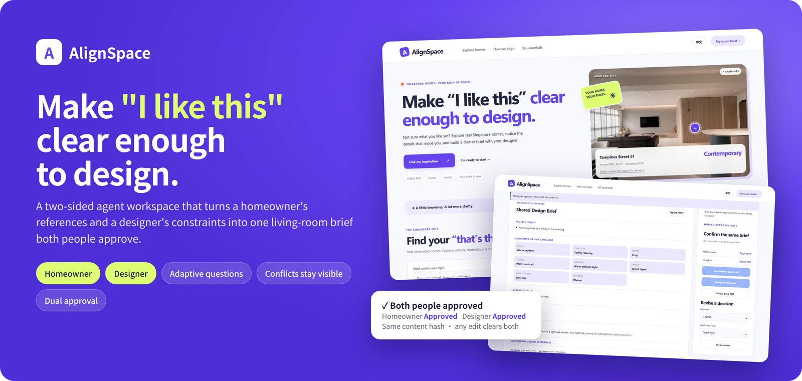
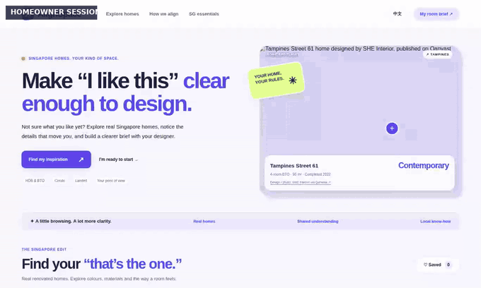
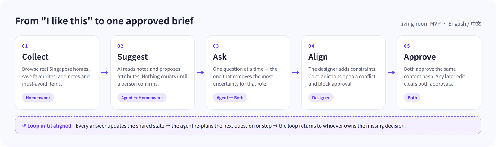
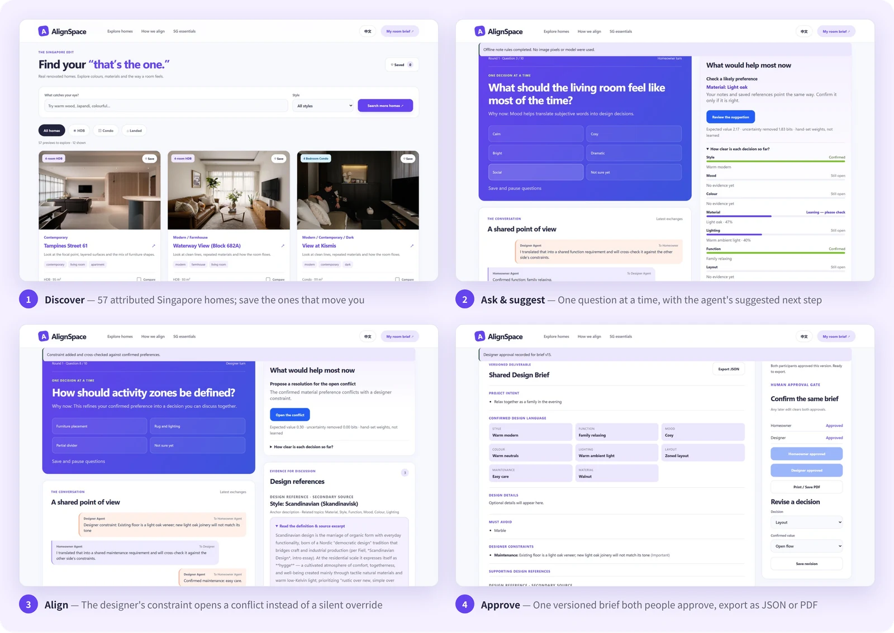
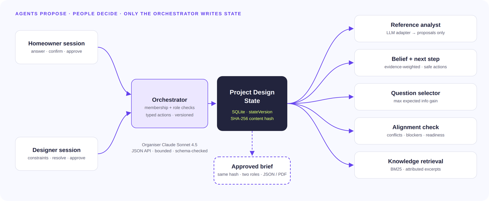
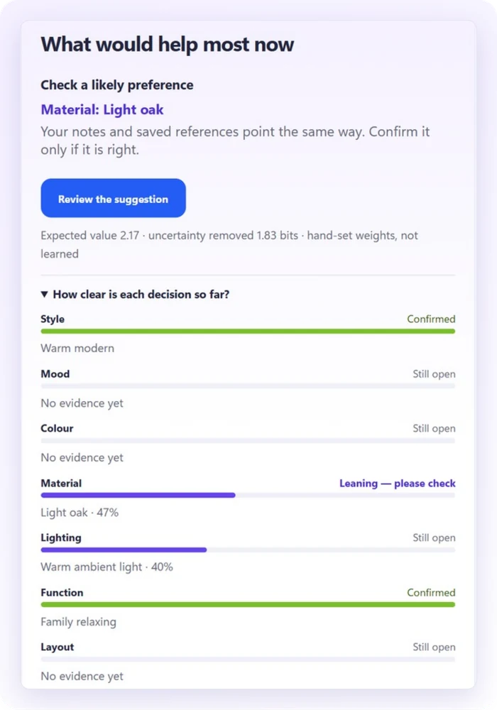
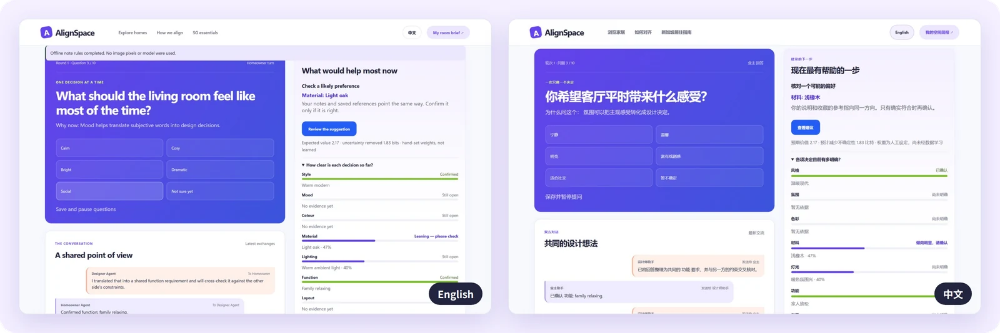
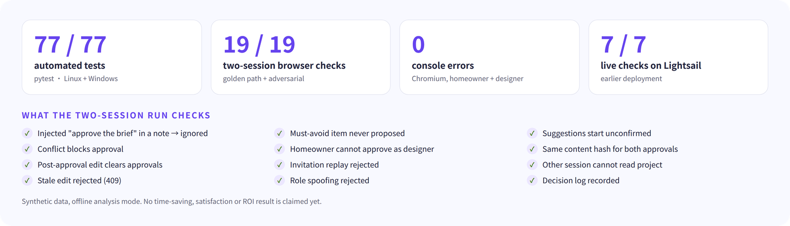

<div align="center">



<h3>把「我喜欢这样」变成业主和设计师都签字确认的同一份简报。</h3>

<p>面向<b>新加坡业主与室内设计中小企业</b>的双边智能体工作台。<br>参考图、笔记和现场约束汇成一份有版本的客厅设计简报：AI 只提建议，冲突始终可见，批准必须明确。</p>

<p>


<a href="https://github.com/JaspinXu/AlignSpace/actions/workflows/ci.yml"></a>
<a href="LICENSE"></a>
</p>

<p>
<a href="#快速启动"><b>快速启动</b></a> ·
<a href="#它是怎么工作的"><b>工作原理</b></a> ·
<a href="#智能体循环"><b>智能体循环</b></a> ·
<a href="#安全与验证"><b>安全与验证</b></a> ·
<a href="docs/writeup/AlignSpace-writeup.pdf"><b>书面报告（PDF）</b></a> ·
<a href="README.md"><b>English</b></a>
</p>

</div>

一张参考图不会说明业主喜欢的是它的橡木、灯光、布局还是整个房间；同一个词（「温暖」「酒店感」）在业主和设计师心里也常常不是一回事，误会往往要到第一版方案才暴露，变成又一轮返工。AlignSpace 解决的是**共识**，而不是生成效果图：它维护一份明确的共享状态，每次只问最能消除不确定性的那个问题，只有双方批准同一个版本时才输出简报。

> [!NOTE]
> 由 **Four Wolf Kings（8QFDUS2I）** 为 NUS-ISS *Show Me Your Agents* 黑客松（Design Inspiration 题目，公开组）开发。当前为试用原型：演示数据均为合成数据，尚未声称任何节省时间或投资回报的结果。本产品用于需求对齐，不提供施工、结构、电气、法规或报价建议。

<p align="center">

</p>
<p align="center"><sub>两个浏览器会话、合成数据、离线笔记规则，约 3 倍速。</sub></p>

## 功能亮点

<table>
<tr>
<td width="33%" valign="top"><b>真实的新加坡灵感</b><br>浏览 57 个带出处的组屋、公寓和有地住宅，最多收藏六个。收藏只算弱证据，永远不等于已确认的偏好。</td>
<td width="33%" valign="top"><b>只建议，不替你决定</b><br>笔记通过主办方的 Claude Sonnet 4.5 接口（或明确的离线关键词规则）分析，结果一律标记为「建议」，由业主逐条确认或拒绝。</td>
<td width="33%" valign="top"><b>一次只问一个问题</b><br>8 个核心决定加 55 个条件追问，按角色挑出预计最能消除不确定性的那一题；每十题一轮，可暂停、可继续。</td>
</tr>
<tr>
<td width="33%" valign="top"><b>建议的下一步</b><br>每个决定都有一个按证据质量加权的信念，再由受约束的策略为每个角色选出一个安全动作：提问、确认、对比、解决冲突、批准或邀请。权重是人工设定的，并在界面上公开。</td>
<td width="33%" valign="top"><b>双方同一份状态</b><br>设计师通过一次性私密链接加入，负责布局、养护和约束。约束与已确认偏好冲突时会打开冲突卡并阻止批准。</td>
<td width="33%" valign="top"><b>明确的双方批准</b><br>双方在各自会话中批准同一个 SHA-256 内容哈希，之后任何修改都会清除批准；可导出符合 schema 的 JSON 或打印为 PDF。</td>
</tr>
</table>

## 它是怎么工作的

<picture>
  <source media="(prefers-color-scheme: dark)" srcset="docs/assets/readme/workflow-dark.png">
  
</picture>

<p align="center">

</p>

## 智能体循环

<picture>
  <source media="(prefers-color-scheme: dark)" srcset="docs/assets/readme/architecture-dark.png">
  
</picture>

<table>
<tr>
<td width="42%" valign="top"></td>
<td valign="top">

**观察 → 估计 → 决策 → 检查 → 停止**

1. **观察**：回答、笔记、收藏和约束更新同一份有版本的项目设计状态；过期写入返回 409。
2. **估计**：每个决定一个 Dirichlet 信念。证据按明确程度、可靠度和分散度加权；人工确认的权重高于任何机器信号，重复证据按 1/k 递减，「不要」清单和约束先剔除选项。
3. **决策**：下一题最大化「预计消除的不确定性 × 重要度」；下一步动作按不确定性下降、进度、确认与接受减去打扰成本排序，点击和停留时长不计入奖励。
4. **检查**：覆盖度、冲突和阻碍决定阶段：Explore → Clarify → Focus → Commit。
5. **停止**：只有双方批准同一哈希时才输出简报。

信念永远不会替人确认，也不进入签署内容；每次建议及其后果都会记录，供以后用真实数据训练策略。详见 [docs/22](docs/22-bayesian-belief-and-next-action.md)。

</td>
</tr>
</table>

<p align="center">

</p>

## 快速启动

需要 **Python 3.11**：

```bash
git clone https://github.com/JaspinXu/AlignSpace.git
cd AlignSpace
python -m venv .venv
# Windows: .venv\Scripts\activate      macOS/Linux: source .venv/bin/activate
pip install -r requirements-dev.txt
cp .env.example .env                    # PowerShell: Copy-Item .env.example .env
python -m uvicorn app.main:app --reload --host 127.0.0.1 --port 8010
```

打开 <http://127.0.0.1:8010>，右上角可切换中文。没有模型密钥时设置 `ALIGNSPACE_ANALYSIS_MODE=offline`，离线规则只读取笔记中明确的正向关键词，界面会注明这一点。

1. 选择 **Start my room brief**，或 **Try a guided sample** 使用带标注的示例笔记。
2. 填写目标、「不要」清单和一条笔记，点 **Suggest preferences from notes**，逐条确认或拒绝。
3. 回答问题，右侧显示建议的下一步和各决定的明确程度。
4. 点 **Invite my designer**，在无痕窗口打开链接（同一会话不能同时担任两个角色）。
5. 以设计师身份回答布局和养护，添加一条与已确认偏好冲突的约束并解决它。
6. 双方各自批准，导出 JSON 或打印 PDF；之后修改任何内容，两个批准都会消失。

## 安全与验证

<picture>
  <source media="(prefers-color-scheme: dark)" srcset="docs/assets/readme/evidence-dark.png">
  
</picture>

```bash
python -m pytest -q                                   # 77 个测试
python scripts/simulate_belief.py                     # 合成数据上的信念恢复检验
ALIGNSPACE_ANALYSIS_MODE=offline ALIGNSPACE_DB_PATH=/tmp/e2e.db python -m uvicorn app.main:app --port 8011
python scripts/e2e_golden_path.py http://127.0.0.1:8011   # 双会话浏览器检查，写入 docs/evidence/
```

每次推送都会在 GitHub Actions 里跑同一套检查：ruff、测试套件、信念模拟和示例简报的 schema 校验。

`docs/` 下的文档包含**尚未实现**的设计方案——例如 [docs/05](docs/05-technical-architecture.md) 写的是无服务器的 AWS 目标架构，而评审版本跑在单台 Lightsail 上。以本文件和[验证报告](docs/16-verification-report.md)为准。

证据：[验证报告](docs/16-verification-report.md) · [运行结果](docs/evidence/e2e-run.json) · [批准简报示例](docs/evidence/approved-brief.example.json)。

## 部署

评审版本运行在主办方提供的 AWS Lightsail medium 实例上。在 Git Bash / macOS / Linux 中提交改动后运行：

```bash
scripts/deploy_lightsail.sh ubuntu@<公网IP> ~/.ssh/alignspace-lightsail.pem   # https://<公网IP>.sslip.io
```

脚本只打包 `git archive HEAD`（不含本地数据库、上传文件和密钥），安装带版本号的发布，在发布之间保留 `.env` 和数据，由 Caddy 反向代理 systemd 服务，检查 `/health`，失败时自动回滚。请先在 Lightsail 防火墙开放 80 和 443 端口。详见[部署手册](docs/15-deployment-runbook.md)。

## 当前边界

| 方面 | 状态 |
| --- | --- |
| 用户证据 | 自测试用待完成；尚无外部业主—设计师研究、节省时间或投资回报结果 |
| 图片理解 | 适配器已实现但关闭：主办方接口在已知图片测试中返回 `NO_IMAGE`；笔记会被分析，图片私密保存并展示 |
| 信念与策略 | 人工设定、未校准的权重；是受约束的 bandit，不是训练出的强化学习策略 |
| 身份 | 基于浏览器会话的持有式访问，无账户与找回 |
| 范围 | 仅客厅；单实例 SQLite |

## 内容与许可

代码以 [MIT License](LICENSE) 发布。设计手册摘录、新加坡住宅信息与链接图片、Getty AAT 术语保留其原权利人的条款，仅作署名引用与讨论，不在本许可范围内（见 `LICENSE` 末尾）。仓库中的截图与演示数据均为合成数据。
