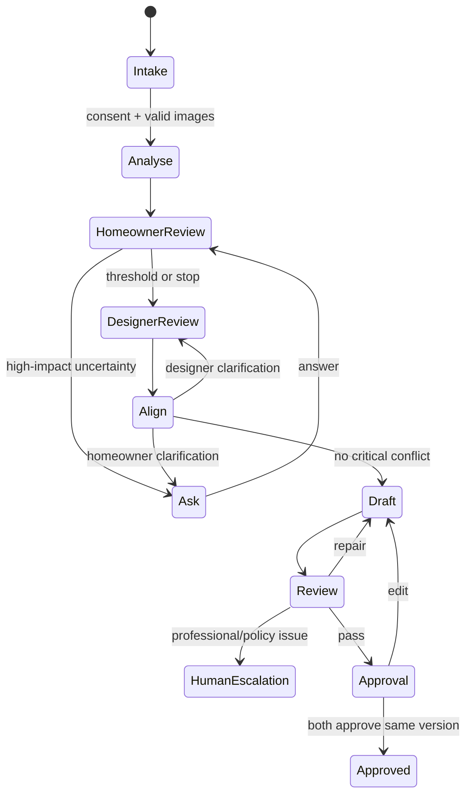

# Agent System Design

## Why this is agentic

The workflow maintains shared state, selects actions from uncertainty/conflict, uses bounded tools, validates output, requests human decisions, and stops at a measurable condition. It is not a fixed prompt chain.

## Agents

### Vision Analyst

Proposes controlled-vocabulary attributes and evidence regions. Cannot infer personal traits, confirm preferences, provide professional advice, or browse arbitrary web content.

### Homeowner Interview Agent

Chooses the lowest-effort, highest-value question. Cannot exceed the question allowance, repeat substantially equivalent questions, pressure users, or reinterpret answers silently.

Candidate score: `0.35 uncertainty + 0.30 impact + 0.20 conflict relevance + 0.10 coverage gap - 0.05 effort - repetition penalty`. Initial hypothesis; tune with data.

### Designer Agent

Structures explicit constraints and explains trade-offs plainly. Cannot invent site facts, compliance, availability, or professional approval.

### Alignment Agent

Compares state, opens neutral conflicts, calculates completeness, and proposes resolution options. Cannot choose a consequential trade-off for humans.

### Review Agent

Checks schema, evidence, certainty, professional claims, prompt injection, permissions, completeness, and approvals. May block, redact, downgrade, or escalate; cannot approve for a user.

## State machine

## Shared-state rules

- Agents propose patches; orchestrator owns canonical state.
- Every patch has actor, source, reason, confidence, timestamp, idempotency key.
- Human-confirmed values outrank proposals but never erase evidence history.
- Constraints never overwrite preferences.
- Lower-trust sources cannot silently replace higher-trust sources.
- Tools are allow-listed per agent.

## Conflict types

Reference conflict; stated-vs-visual; preference-vs-constraint; human-vs-human; evidence gap.

## Escalation

Escalate structural/electrical/regulatory/safety questions; high-impact disagreement after two attempts; potentially sensitive content; external commitment; unsupported consequential claims; or two policy failures.

## Model management

Prompts are versioned in `/prompts`; provider is configurable; every release records model, settings, prompt, policy, and evaluation. Use low temperature for extraction/validation. Cache only within consented retention.

## Failure containment

Maximum 10 questions, 2 retries per model step, and 2 loops per conflict before human escalation. Circuit-break on errors/excessive requests. Manual tagging and editing remain available.

