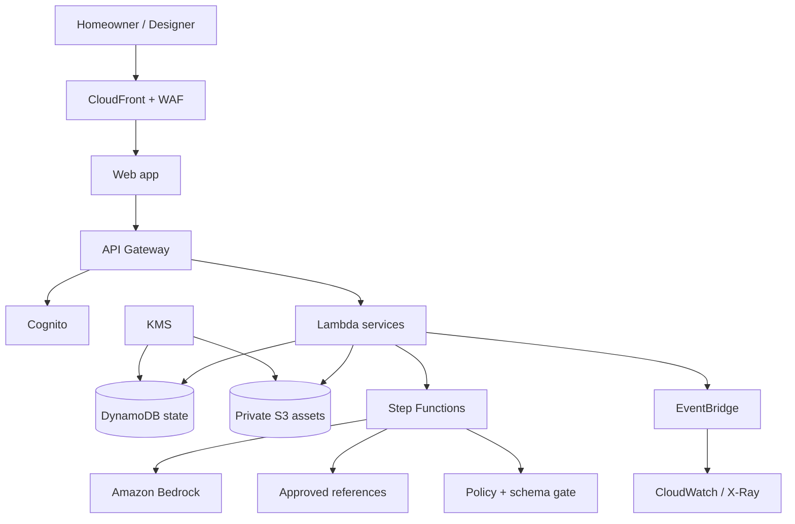

# Technical Architecture

## Proposed AWS design

AWS service selection is proposed, not an official mandate beyond the event's AWS-powered context.

## Responsibilities

- **Web app:** responsive two-role UI; signed uploads; no model keys.
- **Cognito:** membership and role claims.
- **API/Lambda:** authorization, validation, project APIs, signed URLs, exports.
- **Step Functions:** observable, retryable agent flow with bounded loops.
- **Bedrock:** multimodal and language models behind an abstraction.
- **DynamoDB:** brief, versions, approvals, history, idempotency.
- **S3:** encrypted originals, thumbnails, exports, lifecycle deletion.
- **Retrieval:** curated/licensed catalogue with source and rights metadata.
- **CloudWatch/X-Ray:** latency, errors, cost, blocks; no sensitive content.

## Trust boundaries

Browser/edge; application/private storage; orchestrator/model; reference corpus/generated content; operations/customer data. Each requires identity, least privilege, TLS, validation, and auditable access.

## Storage keys

- `PK=PROJECT#<id>, SK=METADATA`
- `PK=PROJECT#<id>, SK=BRIEF#<version>`
- `PK=PROJECT#<id>, SK=ATTRIBUTE#<id>`
- `PK=PROJECT#<id>, SK=QUESTION#<sequence>`
- `PK=PROJECT#<id>, SK=CONFLICT#<id>`
- `PK=PROJECT#<id>, SK=APPROVAL#<version>#<role>`
- `PK=PROJECT#<id>, SK=EVENT#<ulid>`

Use optimistic locking with `stateVersion`.

## Request path

1. Authorize membership and issue a short-lived signed upload URL.
2. Validate type, size, checksum, malware policy, and thumbnail.
3. Orchestrator submits safe content and typed task to Bedrock.
4. Parse output; repair invalid shape once, then fail safely.
5. Review evidence and policy.
6. Update canonical state transactionally and report progress.

## Security controls

- S3 Block Public Access, owner enforcement, KMS encryption.
- Signed URLs limited by time, key, type, size, checksum.
- IAM per function; no wildcard resources in production.
- WAF and project/user quotas.
- Secrets Manager; no secrets in source.
- CloudTrail and protected audit logs.
- Isolated demo/staging/production stacks.

## Resilience

Idempotency, dead-letter queue, timeouts, bounded retries, manual mode, database recovery, S3 versioning during pilot, and deletion that handles every object version/derived copy.

## Observability

Dimensions: environment, step, model, prompt, project pseudonym, outcome, latency, usage, estimated cost, retry, policy. Alarms:

- workflow failure >5% over 15 minutes;
- p95 interactive latency >8s;
- per-project model cost >S$5;
- policy-block rate >2× baseline;
- approval without two valid roles: critical.

## Cost template

`image analysis + interview + designer/alignment + review + storage + requests + observability`

Record current provider prices at deployment time. The <S$3/project figure is a target, not a current claim.

## Deployment gates

Infrastructure review; no critical secret/dependency/IAM/web findings; deletion test; evaluation thresholds; rollback and model kill switch tested.

