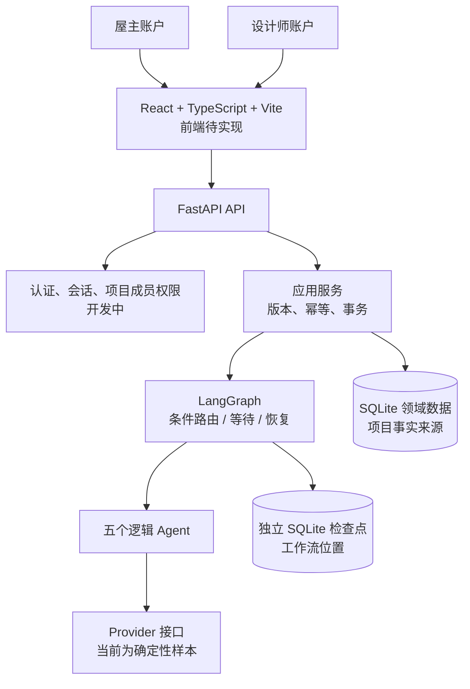

# AlignSpace 项目全景与多模型开发交接文档

## 最新接手入口（2026-09-21，优先于下方历史快照）

## 2026-09-22 前端工作室改版（已完成，未合并）

在 `codex/preference-space-integration` 上完成五页工作区与全站视觉改造，提交 `abe597d`（路由与壳层）、`b968aa8`（五页与草稿生命周期）、`1455eb2`（视觉与空状态）、`69e317b`（浏览器流程导航与新验收）。

- 页面：项目概览、灵感与偏好、设计协商、空间方案、方案审批；`PersistentPanel` 隐藏但不卸载，切页保留未保存表单与空间面板；旧 `?view=brief` 地址仍进 `BriefDetail`，返回落审批页。
- 联合审批抽取为 `space/JointApproval.tsx` 并在审批页使用，后端双哈希校验不变；三维、联合审批、并发冲突断言全部保留。
- 视觉：暖白/炭灰/橄榄绿、衬线标题、8px 间距、44px 触控、`[hidden]` 安全、1024/768 断点。
- 实测：后端 336、前端 184、浏览器 16（含真实 OpenPlan3D）、Ruff/构建通过。报告 `docs/reports/frontend-studio-redesign-validation.zh-CN.md`。
- 截图人工视觉审查未由执行模型完成（环境不支持读图）；四档截图在 `frontend/test-results/studio-*.png` 待人工查看。**真实 DeepSeek 联调待用户配置密钥后验收。**
- 执行前 6 个未提交文件仍保留在工作区，提交时只挑选本任务 hunk，未整文件暂存。

## 下一轮接续入口（2026-09-21）

### ✅ 里程碑②③、评审修复与 OpenPlan3D 集成已完成（2026-09-21 收尾）

**提交**：里程碑② `87ddc6e`、里程碑③ `f8987a0`、交付文档 `263e4db`、评审修复 `71d09df`、OpenPlan3D 双向桥（见最新 `git log`），均在 `codex/preference-space-integration`。**未合并、未推送、未部署、未调用外部付费模型。**

- 实测（本机隔离临时目录）：后端 **336**、前端 **167**（10 文件）、浏览器 **15**（含真实 OpenPlan3D 与双人联合审批）、Ruff/构建/`tsc` 通过。命令见下方原任务书。
- 里程碑②：空间服务与 API（共享可写、删除仅屋主、白名单 PATCH、不可变 `SpaceVersion`）、前端 `spaceAdapter`/`SpaceBoard`。报告 `docs/reports/space-persistence-validation.zh-CN.md`。
- 里程碑③：`SpaceBinding` + `SpaceApproval`（迁移 v8）、绑定/应用/复核与联合审批、受支持材质映射、房间/偏好变更转 `needs_review`、前端 `BindingPanel`。报告 `docs/reports/space-binding-validation.zh-CN.md`。
- 评审修复（针对 5 项 P1）：材质进入 3D handoff；`brief_stale` 时联合审批判为失效（保留历史）；手选材质仍需近似确认；复核仅屋主且必须显式选目标房间并重算近似。
- 第二轮评审修复：handoff 保留已保存家具位置（重开三维不重置）；同步以导入基准版本做并发保护，409 保留草稿并可重试；基线指纹区分导入与用户编辑、同步期间排队不丢弃；支持编辑器新增房间/家具与删空、非矩形轮廓经 `PATCH outline` 落库；人字拼等不可渲染铺法显式标注并要求确认。新增双人联合审批浏览器验收。
- 第三轮评审修复：非法坐标快照整体拒绝（不误解为删除）；编辑器临时 ID → 后端 ID 映射（创建后继续编辑不重复创建/删除）；删除只针对导入基线（409 重试不删协作者新增内容）；3D 浏览器用例改为等待实际导入完成，消除偶发 `null`。
- 第四轮评审修复：改为统一三方合并（基线/草稿/服务器），草稿未触碰的服务器改动不被回退，同字段冲突明确提示；待同步草稿与原始基线绑定，刷新/重新导入不覆盖；新增组件级「刷新+409+重试」链路测试。
- 第五轮评审修复：同一对象的位置与尺寸**按字段组独立合并**（以服务器当前几何为基底），一组冲突不阻断另一组，尺寸/位置互不覆盖；新增对应回归测试。
- **OpenPlan3D 真实集成**：`scripts/fetch_openplan3d.sh` 在固定 SHA `d68cadf703578f2cd3a7c77f820e18d342580c32` 上安装双向桥（`vendor/openplan3d/bridge/alignspaceBridge.ts`）并注入 `editor/+page.svelte`；实现 ready→导入（保留权威房间/对象 ID、按 `alignspaceFloorMaterials` 呈现地板材质、保留家具位置）→ `currentProject` 变更回传 → 受控 API 落库。网络仅限本地，令牌不入 URL。验收 `frontend/e2e/space-3d.spec.ts` 与 `frontend/e2e/space-joint-approval.spec.ts` 当日实测通过（未安装上游时 3D 用例自动跳过）。
- 交付文档：`docs/references/preference-space-delivery.zh-CN.md`、`.env.example`、`docs/references/openplan3d.md`、`docs/14-data-and-asset-register.md`。
- **工作区仍保留 6 个他人未提交文件，未纳入任何提交**（清单见下）。
- **唯一未完成项**：**真实 DeepSeek 联调待用户配置密钥后验收。** 模拟通过 ≠ 真实识图已验证。

> 以下为当时的任务书，保留作历史参考；实际实现以上述完成为准。

**任务**：继续完成「图片偏好分析框架 ＋ OpenPlan3D 集成」的**里程碑②、③与交付文档**。

- 分支 `codex/preference-space-integration`，接续点 HEAD **`5eda6ce`**（基线 `5843774`）。已提交 7 个：`1a5d1bc` 规格+计划+领域模型起步、`b4e51aa` 供应商边界+协议核对+权限定稿、`baa54f1` 候选持久化(v6)、`1a14ff5` 候选服务+API、`9f49d96` 前端候选看板、`bc06a21` 里程碑①报告、`5eda6ce` 空间模型+材质目录+空间版本(v7)。
- **工作区有 6 个他人未提交文件，必须原样保留、不得覆盖或随手提交**：`frontend/e2e/auth-workflow.spec.ts`、`frontend/e2e/flow.ts`、`frontend/src/App.test.tsx`、`frontend/src/App.tsx`、`src/alignspace/auth/routes.py`、`tests/api/test_auth.py`（内容：预算改为自由金额输入 + 注册密码下限 15→8）。浏览器用例 `flow.ts` 目前**依赖**其中的预算字段改动才能通过。
- 接续时实测基线：后端 **305**、前端 **119**（6 文件）、浏览器 **11**（`npm run test:e2e`，配置用隔离临时目录）、Ruff/构建/`tsc` 均通过。命令：`uv run pytest -q`、`uv run ruff check src tests scripts`、`cd frontend && npm test && npm run build && npx tsc --noEmit && npm run test:e2e`。**不要沿用历史数字，先重跑一次。**

### 已完成的②（可直接复用）

- `src/alignspace/domain/space.py`：`build_rectangular_room()`（后端生成稳定 ID：`room-1` / `floor-room-1` / `wall-room-1-north|east|south|west`）、`SpacePlan` 结构校验（ID 唯一、对象必须引用存在的房间、尺寸 1000–20000mm、房间≤12、对象≤200）、`SpaceVersion`（版本+`content_hash`+`created_by/role/source/previous_version`）、`calculate_space_content_hash()`。
- `src/alignspace/domain/space_catalog.py`：`match_material(value, target=...)` 三态（EXACT / APPROXIMATE(带 note，需用户确认) / 抛 `UnsupportedMaterialError`）；`supported_options()`；`MATERIAL_OPTIONS` 表（地面 4 项、墙面 1 项，**地面/墙面目录隔离**）。
- 持久化：`space_versions` 表 + `ProjectState.space_versions` + `UpsertSpaceVersion` 补丁 + repository 读写 + 迁移 **v7**。
- 已有测试：`tests/unit/domain/test_space_model.py`(11)、`tests/integration/persistence/test_repository.py::test_space_versions_round_trip_through_the_repository`、`test_migrations.py`（版本集合到 7）。

### ②剩余（按序 TDD）

1. `application/space_service.py` + `api/routes/space.py`：`GET /space`、`GET /space/versions`、`POST /space/rooms`（手绘或尺寸）、`PATCH /space/rooms/{id}`、`DELETE /space/rooms/{id}`、`PATCH /space/objects/{id}`。统一走 `WriteEnvelope`（`idempotencyKey`/`expectedStateVersion`），**PATCH 只接受受支持字段白名单，禁止整份 JSON 覆盖**；每次实质修改生成新 `SpaceVersion`（`version+1`、新哈希、`previous_version`），非实质（视角/缩放）不产生版本。
2. **权限（已由用户确认，不要再问）**：空间草稿**屋主与设计师同等可写**；**删除房间/对象仅限屋主**（403）。项目隔离、角色判定仍走 `get_actor` + 成员关系。
3. 测试：项目隔离、401/403、并发 409、同键不同内容 409、失败恢复（重启后重载一致）、**历史项目无空间数据仍走原说明书流程**、旧空间审批不得被当作新版本已批准。
4. 前端 `frontend/src/space/`：`spaceAdapter.ts` + 2D 编辑与 3D 预览入口，接入 `Workspace.tsx`（已有 `PreferenceBoard` 先例）。本地存储**只作草稿**；iframe/跨窗口通信校验来源与协议，**不把令牌放 URL**。
5. OpenPlan3D（`https://github.com/laanlabs/openPlan3D`）：**拉取并固定上游提交 SHA**，保留 LICENSE 与第三方模型/贴图归属（写入 `docs/references/openplan3d.md` 与 `docs/14-data-and-asset-register.md`），提供本地启动说明，**不依赖也不调用上游云分享/统计/账户**，验收须检查不向任何上游云服务发送项目数据；其只读 MCP 不能替代编辑接口，必须走受控适配层。

### ③全部（迁移 v8）

- `SpaceBinding`：`roomId`/`floorObjectId` + `target=floor` + 已确认 `attributeId`/`candidateId` + `materialOptionId` + `approximation` + `status(active|needs_review|invalidated)`。
- 闭环：已确认地板偏好 → 绑定房间 → 受支持材质 → 展示预览与适配说明 → 用户确认 → 保存新空间版本 → **重载后保持**。
- 规则：不支持材质明确报错；近似替代标注并要求确认；未确认的模型输出/设计师意见不得覆盖空间；房间拆分/合并/删除或导入改变身份时绑定转 `needs_review`，**不静默转移**；反向修改空间不得自动改写屋主正式偏好。
- **联合审批**：区分「确认应用到空间草案」与「双方批准交付方案」；后端必须校验 `briefVersion/hash` **与** `spaceVersion/hash` 都仍有效；旧说明书审批不得当作新空间方案已批准。规则表见规格 `docs/superpowers/specs/2026-09-21-preference-space-integration-design.md` 第 5 节。

### 交付物与硬约束

- 交付：迁移与兼容说明、模型输入输出协议、环境变量示例、DeepSeek 后续配置与真实联调步骤、OpenPlan3D 本地启动说明、上游提交与素材归属清单、更新交接文档、里程碑②③各自的实际运行结果。
- **不合并、不推送、不部署、不调用外部付费模型**；测试一律使用隔离的临时数据库/检查点/图片目录。
- 报告需单独标记：**“真实 DeepSeek 联调待用户配置密钥后验收。”** 模拟通过 **≠** 真实识图已验证。
- 参考：规格 `docs/superpowers/specs/2026-09-21-preference-space-integration-design.md`、计划 `docs/superpowers/plans/2026-09-21-preference-space-integration-plan.md`、里程碑①报告 `docs/reports/preference-candidates-validation.zh-CN.md`、DeepSeek 协议 `docs/references/deepseek.md`。

> **2026-09-21 追加：图片偏好分析框架（里程碑①完成）。** 开发分支 `codex/preference-space-integration`，基线 `codex/brief-reader` @ `5843774`。新增可替换的分析 provider（确定性 mock + 已实现但**本轮未调用**的 DeepSeek 适配器，缺密钥显式失败不降级），以及候选偏好闭环：屋主选图＋自然语言描述 → 模型提出候选（三类事实分离：关注维度／模型推断／屋主确认；不确定材质不编造取值）→ 屋主逐项确认 → 写入**唯一**正式 `Attribute`（`pref-{candidateId}`，重复确认不重复创建）。重新分析不覆盖已确认/人工编辑内容；删除条目保留已确认偏好；删除来源图后未确认候选失效。迁移 **v6**。接口：`POST/GET /v1/projects/{id}/preference-analyses`、`PATCH/DELETE /v1/projects/{id}/design-entries/{eid}`、`PATCH/POST /v1/projects/{id}/candidates/{cid}`（含 confirm/reject）。实测：后端 293、前端 119、浏览器 11 连续 3 次通过，Ruff/构建通过。DeepSeek 协议已抓官方文档核对（`docs/references/deepseek.md`）。证据见 [里程碑①验证报告](reports/preference-candidates-validation.zh-CN.md)。**里程碑②空间持久化、③地板联动、OpenPlan3D 集成尚未开始。** 工作区仍保留他人 6 个未提交文件（预算金额输入＋密码下限），未合并、未推送、未部署。

> **2026-09-21 验证收尾：** 只读说明书页已通过独立审查及修复复核，补齐浏览器历史导航的未保存输入保护。最新实测为后端 245 项、前端 111 项、浏览器 10 项通过，Ruff 与构建通过。证据见 [说明书页验证记录](reports/brief-reader-validation.zh-CN.md)。当前仍在 `codex/brief-reader`，未合并、未推送、未部署；下方旧阶段数字仅作历史记录。

> **2026-09-20 追加：独立只读说明书详情页。** 开发分支 `codex/brief-reader`，从本地 `shawn` @ `0b10ae5`（规格提交；此前试运行保障合并为 `e31d23b`）创建。工作区“查看设计说明书”进入详情，可刷新深链接、选择历史版本、前进后退；正文只读取所选版本快照。编辑、重新生成与审批仍在工作区；有未保存输入时进入阅读页需确认。复用项目 state GET，无新后端接口或迁移。历史审批可能被现有流程清空，因此缺失显示“历史审批记录不可用”，不能据此推断当时未批准。项目模板残留元数据不当作历史事实展示。原图证据显示来源 ID；不新增导出、版本比较、真实模型或部署。规格与实施计划见 `docs/superpowers/specs/2026-09-20-brief-reader-design.md`、`docs/superpowers/plans/2026-09-20-brief-reader-plan.md`。最终提交和集成状态以 Git 为准。

> **2026-09-16 追加：试运行保障（A–D）。** 在独立分支 `codex/trial-readiness`（基线 `shawn`@`8deab24`）完成：应用重启后在各等待节点可继续、同键重试与业务副作用一致；多标签页/双角色协作（并发约束 409 保留输入并重新提交、旧回答不写入下一题、另一标签页改约束后审批失效并重新生成、跨标签页退出）；离线一致性备份/恢复到新目录（`scripts/backup_local.py`、`scripts/restore_local.py`，清单含哈希，失败不改原数据）；内部模拟试用与备份手册（`docs/runbooks/`）与验证报告（`docs/reports/trial-readiness-validation.zh-CN.md`）。迁移 v5；本轮修复了离线备份的符号链接遗漏、清单完整集合与目标重叠校验，并将注册按 IP 限流上限改为可配置（`ALIGNSPACE_REGISTER_IP_LIMIT`，默认 10）。

> **2026-09-13 追加：屋主结构化偏好收集与细化问答。** 先对参考图片中的**部位**做广问，再按所选部位细化颜色、材质等；结构化回答（喜欢 / 不在意 / 跳过 + 备注）写入共享偏好，并关联来源图片（`evidence.sourceId`）、部位（`targetElement`）与维度（`dimension`）。跳过不建属性；“不在意”仅对该（部位, 维度）建一条 `not_applicable`；不批量建空记录、不默认喜欢整张图；备注仅保存、不解析。删除来源图片会移除其未确认观察。无新增接口（沿用 `questions/next`、`questions/{id}/answer`、`attributes/{id}`）。

> **2026-09-13 追加：设计师真实约束与协商闭环（含第一轮验收修复）。** 设计师可新增/编辑/撤销约束（类别、作用对象或关联偏好、不兼容取值、内容、理由、限制性质、提出者、确认状态），仅记录实际输入；成员可读。**只有设计师显式声明不兼容取值且关联到已确认偏好时才派生 `preference_vs_constraint` 冲突**；约束实质变更会递增 `revision` 并建立新的待处理冲突、保留历史结论；属性/约束/冲突变化会清空审批并把方案标为 `brief_stale`，需 `POST /realign` 重新生成新版本后才能重新审批；未解决冲突不会被自动标记为已解决。真实流程不再注入固定预算约束（`build_fixture_agents` 仅供隔离测试）。接口：`POST/PATCH /v1/projects/{id}/constraints`、`POST /constraints/{id}/withdraw`、`GET /constraints`、`POST /realign`。迁移 v4 新增 `projects.brief_stale`。

- 主仓库：`/Users/shawn_chen/Documents/GitHub/Design_Inspiration_Agents`。试运行保障已合并到本地 `shawn` @ `e31d23b`；说明书规格随后提交为 `0b10ae5`。历史功能分支 `codex/trial-readiness` 已清理，当前开发为 `codex/brief-reader`。是否已合并请以 `git log` 和 `git status` 为准。没有执行 GitHub push。
- 认证、成员/一次性项目码、前端账户与协作工作区（A–E）已经完成上一轮本地集成，不要重做。`.worktrees/authenticated-frontend` 是历史工作区，不是当前接手入口。
- 本轮已实现真实 JPEG/PNG/WebP 上传、受成员权限保护的读取、缩略图与大图入口、屋主软删除、共享图片文件回收、有效图片计数、真实资产来源追溯。单图输入上限 10MB，最多 10 张有效图，分析需要 3–10 张。
- 验收补强：修正 EXIF 方向后清除元数据，覆盖三种格式和 GPS 测试；并发保存采用独立临时文件；上传与文件回收使用 SQLite 写锁协调，避免误删新引用；限制请求中读取图片字节量；上传网络失败以同键同体重试；浏览器测试和后端测试使用独立图片目录。
- 数据库迁移当前为 v5：v3 墓碑历史无文件 fixture 资产（不计入分析门槛）、v4 新增 `projects.brief_stale`、v5 新增 `idempotency_records.completed`（删除+推进可恢复）。正常删除请走 API；演示重置、备份或恢复应同时处理数据库、检查点与图片目录，见 [本地备份恢复手册](runbooks/local-backup-restore.zh-CN.md)。
- 本轮验证：后端 193 项、前端 49 项测试通过，TypeScript/Vite 构建与 Ruff 通过；1 条真实双账户浏览器流程通过，覆盖 1600×1200 大图上传、预览、删除及方案双人审批。
- 设计师约束轮验证（在图片轮之后，含三轮验收修复）：后端 215 项、前端 55 项测试通过，Ruff/构建通过；1 条双账户浏览器流程覆盖“设计师录入约束 → 派生冲突 → 屋主回应 → 生成说明书 → 双方审批 → 审批后修改约束 → 方案过时 → 重新生成 → 双方重新审批”。
- 屋主访谈轮验证（在约束轮之后）：后端 220 项、前端 58 项测试通过，Ruff/构建通过；双账户浏览器流程改为结构化访谈（广选部位 → 逐部位细化确认/不在意/跳过 → 约束协商 → 审批）。方案编辑（无论是否过时）都以后端权威状态重建系统字段、仅允许改 `goals`，`realign` 保留用户已编辑的 `goals`，冲突身份绑定约束版本与匹配取值。
- 试运行保障验证（本轮）：后端 243 项、前端 58 项测试通过，Ruff 与构建通过；浏览器套件 9 条连续 3 次通过（`auth-workflow` 1 + `collaboration-resilience` 8），覆盖同一约束并发编辑、删除来源图后另一页面恢复下一步、刷新晚于退出的竞态、重启后内容保全与备份恢复。内部模拟试用与证据见 `docs/reports/trial-readiness-validation.zh-CN.md`。
- **仍未实现**：真实视觉/语言模型推理、自然语言约束抽取、云部署、装修效果图生成。真实上传不等于真实图像理解；当前每张图仍产生四条固定模拟观察，必须由屋主确认，不能当作模型识别结果。屋主访谈已是结构化选择，不做自由文本理解。
- **可能的下一阶段（需用户确认，不是“必须接多模态”）**：若继续，先确定真实多模态 provider 的配置与结构化输出协议并接入 Vision Analyst，保持“观察/推测”与“屋主确认偏好”分离，随后再替换固定模拟的访谈与约束逻辑；也可先评审/合并当前试运行分支。供应商、凭据和调用费用需单独确认，本轮没有外部模型调用。
- 运行入口：[后端说明](../README.backend.md)、[前端与浏览器验收说明](../README.frontend.md)、[图片阶段规格](superpowers/specs/2026-09-12-real-image-upload-design.md)。

## 历史快照（以下进度、分支指引和任务清单不再代表现状）

> **本地集成入口（2026-09-12）**：下文保留的是早期交接快照，其中工作区、未完成事项和测试数量已经过时。认证、成员管理和前端 C/D/E 的集成入口为主仓库 `/Users/shawn_chen/Documents/GitHub/Design_Inspiration_Agents` 的本地 `shawn` 分支，前端开发来源为 `codex/authenticated-frontend-ui`。本轮在 `39d3c1d` 基础上修复会话循环、退出与刷新竞态、设计师入口、项目 URL、问题输入、偏好覆盖、草稿保留及审批内容一致性，并添加真实双账户浏览器验收。合并前验证：前端 41 项测试、后端 154 项测试、1 条双账户浏览器完整流程、构建和 Ruff 均通过。接手前请先读 [最新运行与验收说明](../README.frontend.md)，并执行 `git status` 核对实际分支和改动；不要按下文旧快照重新实现 A–D。当前仍为模拟图片分析和固定设计师约束，未部署到云端。

> 快照日期：2026-09-12（Asia/Singapore）。本文为项目交接资料，不是已完成功能清单。
>
> 读者：第一次接触本项目、准备参与实现或评审的模型与开发者。
>
> 当前结论：**确定性后端工作流已合并到本地 `shawn` 并通过测试；真实认证与前端正在独立 worktree 开发，尚未完成集成，且包含未提交代码。**

## 本地地址（接手入口）

- **主仓库**（`shawn`，稳定后端）：
  `/Users/shawn_chen/Documents/GitHub/Design_Inspiration_Agents`
- **当前开发工作区**（`codex/authenticated-frontend`，包含未完成、未提交的认证与前端代码）：
  `/Users/shawn_chen/Documents/GitHub/Design_Inspiration_Agents/.worktrees/authenticated-frontend`
- **本交接文档**：
  `/Users/shawn_chen/Documents/GitHub/Design_Inspiration_Agents/docs/15-project-handoff.zh-CN.md`

继续认证与前端开发时，进入上面的**当前开发工作区**。这些是本机文件夹路径，不是网页访问地址；其他机器需先取得完整源码并使用其实际目录。

## 阅读导航

- 先理解产品：第 1–4 节。
- 了解代码与接口：第 5–9 节。
- 确认本地进度与失败原因：第 10–12 节。
- 开始工作与分工：第 13–16 节。
- 不要漏读：第 2 节的分支位置、第 11 节的当前限制、第 17 节的接手提示词。

## 1. 项目是什么，为什么要做

### 1.1 产品定位

项目名称为 **AlignSpace — Design Inspiration Agents**。

这是面向屋主和室内设计师的双向需求对齐系统。首个产品场景是新加坡住宅的客厅装修，目标用户包括屋主和中小型室内设计公司。

屋主提供装修案例或灵感图片，表达喜欢与不喜欢的部分。系统协助把这些模糊表达转为可追溯的偏好，结合设计师提出的预算、空间、功能等约束，持续澄清分歧，最终形成双方确认的设计需求说明书（Design Brief）。

项目要解决的是：

- 屋主喜欢一张图片，可能只喜欢其中的灯光，而非整张图的装修风格。
- “温馨”“现代”“高级”等表达缺少共同定义。
- 设计师很难从散落的图片和聊天记录中准确提炼真实需求。
- 预算、施工条件等约束出现较晚，导致方案反复修改。
- 双方需要知道哪些已经确认、哪些只是 AI 推测、哪些仍有冲突。

### 1.2 当前交付物是什么

当前目标产物是**结构化、可编辑、有版本且需要双方审批的 Design Brief**。

它不是装修效果图、施工图、精确报价、采购订单或合规证明。用户明确要求现阶段不要加入装修方案可视化，也没有授权新增 Visualization Agent。

### 1.3 产品目标与已实现结果要区分

旧 PRD 中的“最多 10 个澄清问题”“20 分钟内完成”“80% 对齐率”“每项目成本低于 S$3”等，分别属于工程约束或待验证的产品指标。

目前能够证明的是特定本地测试场景通过，不能声称已通过真实用户研究、真实图像识别评估或线上性能验证。尤其不能将代码中的 completeness 当成真实的人类一致率。

## 2. 仓库、分支和工作区：开始前必须弄清楚

### 2.1 仓库位置

远程仓库地址：

```text
https://github.com/JaspinXu/Design_Inspiration_Agents.git
```

本机主仓库：

```text
/Users/shawn_chen/Documents/GitHub/Design_Inspiration_Agents
```

当前未完成工作的独立工作区：

```text
/Users/shawn_chen/Documents/GitHub/Design_Inspiration_Agents/.worktrees/authenticated-frontend
```

本文后续相对文件路径均以**对应代码所在工作区根目录**为基准。其他机器应替换绝对路径，不要依赖本机用户名。

### 2.2 两个工作区的不同状态

| 位置 | 当前分支 | HEAD | 真实状态 |
|---|---|---|---|
| 主仓库 | `shawn` | `7c0a06f` | 第一阶段后端已合并；本次重跑 122 项测试全部通过 |
| 认证/前端 worktree | `codex/authenticated-frontend` | `84cb7bb` | 在上述后端基础上提交了设计与计划；实现代码大量尚未提交 |

提交说明：

- `7c0a06f`：`test: verify backend agent workflow`。
- `84cb7bb`：`docs: plan authenticated frontend implementation`。
- `84cb7bb` **只代表设计与计划已提交，不代表认证和前端已提交**。

主分支相对本地记录的 `origin/shawn` 显示领先 16 个提交。本文没有联网 fetch，因此这不是对远端最新状态的重新核验。此前没有执行 GitHub push。

上一个 `codex/backend-agent-workflow` 功能分支已经本地合并并清理；不要尝试在已删除的旧 worktree 继续工作。

### 2.3 当前未提交内容

认证/前端 worktree 中已经修改的受跟踪文件：

```text
pyproject.toml
uv.lock
src/alignspace/api/dependencies.py
src/alignspace/api/errors.py
src/alignspace/main.py
src/alignspace/persistence/database.py
```

新增但未提交的实现/测试目录和文件：

```text
src/alignspace/auth/
src/alignspace/persistence/migrations.py
tests/api/test_auth.py
frontend/
```

主仓库还有一份未跟踪的认证/前端设计草案：
`docs/superpowers/specs/2026-09-11-authenticated-frontend-design.md`。

worktree 中同名规格已经提交，并标为用户确认。主目录的草案文字没有同步状态，**不要根据“草案”二字再次把整个设计当成未获批准**。

### 2.4 给远程模型共享代码时的注意事项

仅提供 GitHub 地址、仅 checkout `84cb7bb`，或只分享 `git diff`，都不足以得到完整的当前开发现场：

- 尚未 push 的提交不会出现在远端。
- `git diff` 默认不包含新增未跟踪文件内容。
- `.worktrees/` 被忽略，不会因为提交主仓库而自动上传其中的文件。
- `node_modules/`、`.venv/`、数据库与环境密钥不应当作源码共享。

给其他模型本地目录访问权，或明确提供“已提交代码 + 未提交修改 + 新增源码文件”。不要在交接时把真实密码、JWT 密钥或数据库内容一起打包。

## 3. 用户已经做出的决定

这些是已确认的方向，接手模型通常不需要再逐项询问：

| 决策 | 已确认内容 |
|---|---|
| 开发顺序 | 先完成后端基础，再进入真实登录与前端阶段 |
| 前端技术栈 | React + TypeScript + Vite |
| 身份系统 | 项目自建邮箱密码认证，不使用角色切换冒充真实账户 |
| 第一版账户功能 | 注册、登录、退出 |
| 暂不包含 | 邮箱验证、忘记密码、邮件服务 |
| 进入同一项目 | 屋主创建项目，设计师登录后通过项目码加入 |
| 第一版成员模型 | 每项目一名屋主、一名不同账户的设计师 |
| 偏好存储 | 稀疏记录，不为每个未提及属性预建空数据 |
| 问答策略 | 先询问喜欢哪些其他部分，再针对选中的部分细问 |
| 最终交付 | Design Brief，需要同版本双方确认 |
| 效果图生成 | 明确暂缓，不引入新的可视化 Agent |
| 代码同步 | 当前本地开发；此次认证/前端尚未请求合并或上传 |

已经批准的认证/前端规格进一步确定：

- 密码用 Argon2id 哈希；注册密码长度 15–128 字符。
- 邮箱去除首尾空白并转小写；密码不做 trim。
- 访问 JWT 15 分钟有效，刷新会话绝对有效期 7 天。
- JWT 仅保存在浏览器内存；刷新令牌保存在 HttpOnly Cookie。
- 刷新令牌轮换，旧令牌重用撤销对应会话。
- 退出撤销当前会话，受保护请求同时核验会话是否有效。
- 项目码 12 位无歧义随机字符，24 小时有效，成功使用一次。
- 屋主重新生成项目码会撤销旧码；数据库只保存摘要。
- 前端默认中文，Agent 原始回答保持实际返回内容。
- 首版 UI 必须明确标注样本模式，不能假装支持真实图像理解。

这些参数有明确规格来源，但仍需实现与测试，不能把“决定采用”写成“已经完成”。

## 4. 产品思路与协作示例

### 4.1 图像事实不等于用户偏好

屋主提供图片并说：

> 我喜欢墙面颜色、桌椅材质和地板颜色。

系统应区分：

| 信息 | 正确语义 |
|---|---|
| 屋主明确说喜欢墙面米色 | 可以经明确提交/确认形成屋主偏好 |
| 视觉分析发现墙面看起来是涂料 | 只属于待确认观察，不等于屋主喜欢涂料 |
| 屋主没有谈及地板材质 | 不推断喜欢或不喜欢；不必自动创建空记录 |
| 屋主明确表示地板材质不重要 | 可以成为显式决策，而非猜测 |
| 设计师说某材料超预算 | 保存为设计师约束，并与偏好分别保留 |

先问“除了墙面、桌椅和地板，还有没有其他希望保留的部分”，再细问灯光、材质、颜色等。不能强迫用户一次解释图片中所有细节，也不能自动确认每一项视觉观察。

### 4.2 一个预期的完整例子

1. 屋主选择几张客厅参考图，明确喜欢米色墙、木质椅子、浅色地面。
2. Vision Analyst 提出观察，例如“暖米色墙面”“橡木椅子”，全部标记为 `proposed`。
3. Homeowner Interview Agent 广泛询问其他喜欢的部分，屋主补充“暖色灯光”。
4. 系统进一步询问灯光细节，屋主确认或修改相应偏好。
5. Designer Agent 整理设计师的预算与可行性约束。
6. Alignment Agent 发现天然石材与预算发生冲突，把决定交还给人。
7. 屋主选择低成本替代方案，系统记录决定及来源。
8. 满足完整性条件后生成 Design Brief，由 Review Agent 检查。
9. 屋主与设计师分别批准同一版本和内容哈希。
10. 此后编辑方案必须生成新版本，旧审批不能自动沿用。

上述是产品意图。当前确定性实现使用固定样本、固定约束和规则匹配完成其中的演示路径；它尚不支持任意图片和任意自然语言输入的泛化理解。

## 5. 整体技术架构

### 5.1 分层



五个 Agent 是同一 Python 后端内的逻辑组件，不是五台服务器，也不是五个独立模型实例。未来可以共享同一个大模型 API，分别使用不同任务、提示词和结构化输出。

### 5.2 每层职责

| 层 | 代码位置 | 职责 |
|---|---|---|
| HTTP/API | `api/routes/`、`api/dependencies.py`、`api/errors.py` | 请求协议、身份依赖、响应与错误映射 |
| 应用服务 | `application/resources.py`、`application/service.py` | 成员校验、资源操作、状态读写、幂等、调用工作流 |
| 领域规则 | `domain/models.py`、`enums.py`、`patches.py`、`policies.py` | 状态语义、类型、约束、版本与审批规则 |
| 工作流 | `workflow/graph.py`、`runtime.py`、`state.py` | 图节点、分支、interrupt 与 resume |
| Agent | `agents/` | 根据输入状态返回状态提案和下一动作 |
| Provider | `providers/mock.py`、`validated.py` | 当前样本输出，以及将来模型适配边界 |
| 持久化 | `persistence/` | SQLAlchemy 表、仓储、事务、审计和幂等记录 |
| 账户模块 | worktree 的 `auth/` | 自建认证基础，尚未完成整体接入 |
| 前端 | worktree 的 `frontend/` | 已有配置与测试；业务实现尚不存在 |

LangGraph 负责执行顺序和暂停恢复。LangChain 相关库是当前依赖体系的一部分，但项目不能简单理解成“一次 LangChain 大模型调用”；目前没有真实 LLM 的运行闭环。

### 5.3 一个写操作如何经过系统

```text
请求 + 身份 + expectedStateVersion + idempotencyKey
→ 校验项目成员与动作权限
→ 校验幂等与版本
→ 读取数据库中的当前状态
→ 按动作直接修改领域状态，或运行/恢复 LangGraph
→ 执行相应领域校验
→ 保存状态、版本、审计和幂等结果
→ 返回新版本及待处理任务
```

这里描述层次责任，不意味着每个已有入口都已经实现完整的细粒度权限矩阵。接入真实账户时仍必须逐个检查敏感写入口。

### 5.4 数据库与检查点的关系

业务状态以领域数据库为准。LangGraph 检查点保存工作流执行位置，不应成为另一个业务事实来源。

已有 `WorkflowService._reconcile_checkpoint` 会在恢复时比较版本，并在需要时用领域状态更新检查点中的投影。但两个 SQLite 文件不是一个跨库原子事务；不能根据“有检查点”推断所有崩溃恢复情形都已完整覆盖。

## 6. 五个 Agent 的职责与真实实现边界

| Agent | 产品职责 | 当前实现 |
|---|---|---|
| Vision Analyst | 从参考图提出带来源、置信度的视觉观察 | `MockVisionProvider` 返回固定四类观察，没有读取真实图片字节 |
| Homeowner Interview | 先广泛识别喜欢的元素，再细化偏好 | 有广泛问题、历史指纹、规则选题；细化候选主要通过英文字符串匹配 |
| Designer | 整理设计师反馈、约束及替代建议 | 默认注入固定预算约束与冲突，不是任意自然语言设计师分析 |
| Alignment | 根据偏好、约束、冲突和完整性选择下一动作 | 确定性规则路由，不是持续后台运行的独立监听服务 |
| Review | 检查方案结构、完整性及高风险声明 | 使用 JSON Schema 和规则检查，返回 pass/repair/escalate 等动作 |

`agents/question_selector.py` 是选题辅助模块，**不是第六个 Agent**。

当前候选问题评分公式：

```text
0.35 × uncertainty
+ 0.30 × impact
+ 0.20 × conflict_relevance
+ 0.10 × coverage_gap
- 0.05 × effort
```

历史中已有相同 fingerprint 的候选先被排除。它是启发式评分，不是已经实现了基于真实参考库概率分布的严格信息增益计算。

“Alignment 持续比较”应理解为相关工作流步骤执行时重新判断。并非任何 API 编辑都会自动运行整个图；例如直接修改属性与直接关闭冲突后，恢复工作流的方式需要前端集成时核对。

## 7. 核心状态、领域规则与约束

### 7.1 ProjectState

当前领域状态包含：

```text
projectId
stateVersion
status
attributes[]
constraints[]
questions[]
conflicts[]
briefVersions[]
approvals[]
completeness
currentNode
waitReason
```

项目成员、房间类型、预算、consent、assets 等通过资源模型和持久化记录单独组织，不全部直接放在 `ProjectState` 内。

Python 字段使用 snake_case，HTTP JSON 使用 camelCase。统一转换位于 `DomainModel`。

### 7.2 偏好 Attribute

主要字段：

```json
{
  "id": "wall-colour",
  "targetElement": "wall",
  "dimension": "colour",
  "value": "warm beige",
  "status": "proposed",
  "confidence": 0.86,
  "actor": "vision_agent",
  "evidence": [
    {
      "sourceType": "image",
      "sourceId": "living-room-1",
      "description": "Mock image observation: wall colour"
    }
  ]
}
```

状态：`proposed`、`confirmed`、`rejected`、`conflicted`、`unresolved`、`not_applicable`。

关键语义：

- `proposed`：候选观察，尚未代表人的选择。
- `confirmed`：明确确认的需求。
- `unresolved`：已经识别并跟踪的未决问题，不是所有空字段的默认占位。
- `not_applicable`：显式不适用。
- 未提及、未观察且无必要跟踪的属性，不建立记录。

现有 Evidence 只有来源类型、来源 ID 和描述。旧设计提到图像区域坐标、模型版本等更丰富字段，**当前模型没有完整实现这些字段**。

### 7.3 约束 Constraint 与冲突 Conflict

Constraint 包含 category、statement、rationale、severity、verificationStatus、owner、evidence、verifiedBy 等。

`verified` 约束要求专业身份归属、核验人以及专业审核来源证据。不能把设计师普通陈述自动提升为专业核验事实。

Conflict 保存 type、summary、impact、status、resolution、severity、resolutionAttempts。偏好与约束应各自保留，冲突负责记录两者之间的关系和解决决定。

当前人类冲突决策接口接受 `resolved` 或 `accepted_unresolved`。题目回答路径也可以保存冲突选择。后者并不代表已实现语义理解：当前图对于冲突问题主要保存非空答案并推进状态。

### 7.4 版本与幂等

- `stateVersion` 是项目状态版本，外部成功写操作按仓储约定递增。
- `brief.version` 是设计说明书版本，不能与 `stateVersion` 混用。
- 同幂等键、同请求内容：返回首次结果。
- 同幂等键、不同请求内容：返回 409。
- 状态版本过旧：拒绝覆盖，返回 409。
- 网络丢失响应后的重试，应继续发送**相同键、相同版本、相同请求体**。
- 用户检查最新状态并有意修改后再次提交，使用新键与新版本。

并非所有资源入口当前都要求此 envelope：项目创建使用普通 JSON，项目删除也有自己的协议。接手时必须以具体路由签名为准。

### 7.5 完整性与审批

当前 completeness 按八个维度计数：

```text
style, colour, material, lighting, layout, furniture, mood, function
```

状态属于 `confirmed`、`unresolved`、`not_applicable` 的维度计入覆盖：

```text
completeness = 已覆盖的上述维度数 / 8
```

生成规则的阈值是 ≥0.85，所以在此公式下至少要覆盖 7/8，即 0.875。同时不得有 open 的 critical 冲突。

这是“已明确处理的维度覆盖率”，不是“全部需求已经确认”，因为 unresolved 也计入。

最终批准还需要：

- 屋主与设计师的独立审批记录。
- 同一个 brief version。
- 同一个内容 SHA-256。
- 对应完整性及关键冲突条件满足。

已实现的 Brief 编辑会生成新版本并清除有效审批。至于先批准后再直接修改底层属性、约束或冲突的所有路径，接手模型应检查它们是否同步失效旧方案及审批，不能仅凭 Brief 编辑测试推断全路径已正确处理。

### 7.6 安全检查的现状

现有规则覆盖 structural、electrical、regulatory、safety-critical、exact-price、live-availability 六类声明，并提供专业复核路由。

主要实现是规范化文本后的英文关键词匹配与递归扫描 JSON。它不等于完整的多语言安全分类器，不能宣称能可靠识别任意中文隐含施工建议或全部提示注入形式。

## 8. 工作流实际如何运行

主要图节点：

```text
vision_analysis
homeowner_interview
wait_homeowner
designer_review
wait_designer
alignment
wait_professional
draft_brief
review
awaiting_approval
stop_unresolved
```

基本路径：

```text
START → vision_analysis → homeowner_interview → wait_homeowner
                                              ↓ 回答
                                           alignment
                 ┌────────────────────────────┼─────────────────────┐
            问屋主/细化                   designer_review          专业复核
                 ↑                            ↓                     ↓
                 └──────────── alignment ←────┘              wait_professional
                                              ↓ 满足条件
                                          draft_brief
                                              ↓
                                            review
                                              ↓ 通过
                                       awaiting_approval
```

模型输出/规则判断可以让图再次提问，也可能明确停止并保留未决事项。最多 10 个屋主问题、冲突处理最多 2 次的限制应继续保留。

可学习现有闭环的最佳入口是 `tests/conftest.py` 中的 `WorkflowDriver.complete()`。该验收路径会：

1. 创建项目及两个模拟成员。
2. 登记三条样本记录。
3. 启动分析，获得广泛问题。
4. 回答包含 lighting 的广泛偏好。
5. 手动确认视觉观察。
6. 显式新增 style、layout、furniture、mood、function 等偏好。
7. 回答细节问题。
8. 处理固定的天然石材预算冲突。
9. 获取方案。
10. 两个模拟成员分别审批。

**不要省略这里的显式确认与手动新增步骤，然后期待任意聊天自动补全所有必要维度。**

## 9. API 合同：已存在与计划新增必须分开

### 9.1 稳定后端已有接口

| 方法 | 路径 | 用途 |
|---|---|---|
| POST | `/v1/projects` | 创建项目；稳定版仍要求 designerId |
| GET | `/v1/projects/{projectId}` | 读取项目基础信息和 assets |
| DELETE | `/v1/projects/{projectId}` | 删除项目 |
| POST | `/v1/projects/{projectId}/assets` | 登记 fixture 记录，不是上传文件 |
| DELETE | `/v1/projects/{projectId}/assets/{assetId}` | 删除记录并处理检查点 |
| POST | `/v1/projects/{projectId}/analysis-runs` | 启动确定性分析 |
| PATCH | `/v1/projects/{projectId}/attributes/{attributeId}` | 修改或显式新增偏好 |
| GET | `/v1/projects/{projectId}/questions/next` | 获取待回答问题 |
| POST | `/v1/projects/{projectId}/questions/{questionId}/answer` | 回答并恢复工作流 |
| POST | `/v1/projects/{projectId}/designer-reviews` | 按设计师等待路径恢复 |
| POST | `/v1/projects/{projectId}/conflicts/{conflictId}/resolve` | 保存冲突决策 |
| GET | `/v1/projects/{projectId}/briefs/latest` | 获取最新方案 |
| PATCH | `/v1/projects/{projectId}/briefs/{version}` | 编辑方案并创建新版本 |
| POST | `/v1/projects/{projectId}/briefs/{version}/approvals` | 审批指定版本和哈希 |

稳定 `shawn` 用 `X-Actor-Id`、`X-Actor-Role` 模拟身份。开发分支已修改依赖以使用 Bearer 认证，旧测试尚未迁移。

典型工作流写请求：

```json
{
  "idempotencyKey": "client-generated-unique-key",
  "expectedStateVersion": 3,
  "data": {"answer": "I also like the warm lighting"}
}
```

显式新增偏好时 `data`：

```json
{
  "targetElement": "living_room",
  "dimension": "function",
  "value": "conversation and reading",
  "status": "confirmed"
}
```

审批时 `data`：

```json
{"contentHash": "从最新方案响应取得的真实哈希"}
```

编辑方案时，`data.payload` 必须是完整且符合 `schemas/design-brief.schema.json` 的 JSON 对象。先从最新 Brief 取得 payload，再编辑允许的内容；不要把它转为字符串，也不要只发送其中一个字段代替完整对象。

错误实际结构有 `error` 外层：

```json
{
  "error": {
    "code": "STATE_VERSION_STALE",
    "message": "expected version 3, current version is newer",
    "correlationId": "request-correlation-id",
    "recoverable": true,
    "details": {}
  }
}
```

不要将错误字段误写为顶层协议。

### 9.2 认证分支已写入的接口

以下只在开发 worktree 的未提交代码中存在：

```text
POST /v1/auth/register  {email,password} → {accessToken,user}
POST /v1/auth/login     {email,password} → {accessToken,user}
POST /v1/auth/refresh   无请求体，通过 Cookie 刷新
POST /v1/auth/logout    无请求体，撤销会话并清 Cookie，204
GET  /v1/auth/me        Bearer → user
```

`user`：

```typescript
type User = {
  id: string;
  email: string;
  emailVerified: false;
};
```

当前 Cookie 名为 `alignspace_refresh`，Path 为 `/v1/auth`，HttpOnly、SameSite=Strict；生产配置启用 Secure。

认证写接口验证 Origin。浏览器发送 Origin，前端不要尝试设置浏览器禁止手动控制的 Origin 请求头；测试客户端可以显式提供允许的 Origin。

### 9.3 已批准但尚未实现的项目协议

```typescript
type Project = {
  id: string;
  roomType: string;
  budgetBand: string;
  consent: boolean;
  status: string;
  stateVersion: number;
  assets: {
    id: string;
    fixtureId: string;
    mediaType: string;
    sizeBytes: number;
  }[];
  role: "homeowner" | "designer";
  designerJoined: boolean;
};
```

| 方法与路径 | 预期行为 | 本次核对状态 |
|---|---|---|
| GET `/v1/projects` | 只返回当前成员的 Project[] | 未实现，当前返回 405 |
| POST `/v1/projects` | 只需 roomType、budgetBand、consent | 尚未改造，仍要求 designerId |
| POST `/v1/projects/{id}/join-code` | 返回 code、expiresAt | 未实现 |
| POST `/v1/projects/join` | 已登录用户用 code 加入，返回 Project | 未实现 |
| GET `/v1/projects/{id}/state` | 返回项目、完整状态和待处理问题 | 未实现 |

完整状态响应的目标结构：

```typescript
type ProjectSnapshot = {
  project: Project;
  projectState: ProjectState;
  pendingQuestion: Question | null;
};
```

项目码生成响应约定为 `{code: string, expiresAt: number}`。建议统一为 Unix 秒，与现有认证存储时间方式一致，并在接口/前端测试中锁定单位，避免秒与毫秒混用。

## 10. 进度清单与本次真实验证结果

### 10.1 能力矩阵

| 功能 | 状态 | 证据/说明 |
|---|---|---|
| FastAPI + LangGraph + SQLite 工作流 | 已在本地 shawn 完成 | 基线 122 passed |
| 五个逻辑 Agent | 已有确定性实现 | agents 与 mock provider |
| 稀疏偏好、显式修订 | 已有 | domain / API 测试 |
| 问题、冲突、方案与双方审批 | 已有样本闭环 | WorkflowDriver.complete |
| 幂等、版本冲突、审计 | 已有基础实现 | 仓储及集成测试 |
| 密码哈希、JWT、刷新与撤销 | 已写入开发分支，部分验证 | auth 模块；4 项认证测试通过 |
| 真实认证与所有已有 API 的完整集成 | 未完成 | 旧 API 测试尚未迁移 |
| 项目码、我的项目、完整状态读取 | 未完成 | 新目标接口尚未添加 |
| 前端工程与依赖 | 已建立 | frontend 配置与锁文件 |
| 前端 API 客户端、登录和业务页面 | 未实现 | 缺少 api.ts / App.tsx / Workspace.tsx 等 |
| 双真实账户浏览器 E2E | 未实现 | 尚无 Playwright 测试与浏览器验收 |
| 真实图片上传与视觉识别 | 未实现 | 当前只有 fixture 元数据 |
| 真实 LLM 与参考库检索 | 未实现 | 适配接口已留出 |
| AWS/Lightsail 部署 | 未实施 | 后续阶段 |
| 装修效果图生成 | 不在当前范围 | 用户明确暂缓 |

### 10.2 2026-09-12 的检查结果

本次为编写交接文档重新执行了以下检查，没有修复业务代码。

| 工作区 | 命令 | 结果 |
|---|---|---|
| 主仓库 shawn | `uv run --no-sync pytest -q` | **122 passed in 1.41s** |
| 认证/前端 worktree | `uv run --no-sync pytest tests/api/test_auth.py -q` | **4 passed, 2 failed** |
| 认证/前端 worktree | `uv run --no-sync pytest -q --tb=no` | **96 passed, 2 failed, 30 errors** |
| 认证/前端 worktree | `uv run --no-sync ruff check src tests` | **3 个 I001 导入排序问题** |
| worktree/frontend | `npm test -- --reporter=dot` | **2 个测试文件加载失败，0 个测试实际执行** |

Python 命令实际额外设置了 `UV_CACHE_DIR=/private/tmp/alignspace-uv-cache`，这是本机缓存设置，不是业务依赖。

失败原因：

1. 两个认证测试都碰到了尚不存在的 `GET /v1/projects`，当前响应为 405。
2. 原有 30 个 API/验收测试在 fixture 启动阶段报错：没有配置满足要求的 `ALIGNSPACE_AUTH_SECRET`。
3. 即使添加测试密钥，旧测试仍使用模拟身份头；还需要明确迁移到真实账户，或仅在测试内部 override 身份依赖。不能把假身份恢复到真实服务来“修复测试”。
4. Ruff 问题位于 `api/dependencies.py`、`api/errors.py`、`tests/api/test_auth.py`。
5. 前端测试引用了不存在的 `api.ts`，Workspace 与 types 实现也未完成；这是施工中的测试骨架，不是可运行产品。

测试结果是这个工作区快照的证据，不代表之后其他模型修改后仍成立。

### 10.3 暂停点

上一轮工作由用户中断，前端子任务也已经暂停。前端子任务报告没有启动开发服务器、没有提交源码。当前本文编写任务仅做检查与文档，不恢复前后端开发。

## 11. 接手时要知道的差距与注意点

### 11.1 真实认证的剩余工作

当前 `auth/` 已有：

- 用户、会话、刷新摘要、限流、项目码和迁移表模型。
- Argon2id 哈希、邮箱标准化、统一错误密码提示。
- HS256 JWT，issuer/audience/有效期校验。
- 会话数据库核验、刷新轮换、旧令牌重用撤销。
- SQLite `BEGIN IMMEDIATE` 串行化需要原子消费的写事务。
- 持久化限流记录与认证错误格式。
- 应用启动校验密钥和 Origin 配置。

仍需完成/验证：

- 密钥缺失、JWT 过期、错误 issuer/audience/算法、会话绝对过期等针对性测试。
- 注册及刷新并发行为、退出与刷新竞态、多标签页轮换联动。
- 真实账户对原有资源与工作流接口的整体权限矩阵。
- 项目码生成、消费、撤销、重复加入和并发兑换。
- 我的项目列表和完整状态 API。
- 旧测试 fixtures 与新认证测试的分工。
- 数据库迁移重复运行、已有数据和唯一约束行为。
- 对外错误与日志不得泄露密码、原始刷新令牌或项目码。

当前迁移文件主要是添加表和索引并记录版本，不是已经具备完整版本演进能力的迁移框架。该 SQL 和事务方案面向 SQLite，迁移其他数据库时需要重新实现。

### 11.2 真实账户集成时不能留下的旧行为

创建项目仍通过 `designerId` 建立成员，这与“设计师本人登录后输入项目码加入”的新设计冲突。应当改造公开创建协议，不能让屋主随意把另一个真实用户 ID 直接绑定成设计师。

`ProjectView` 尚未包含 role/designerJoined，后端与前端约定目前不同。

角色应按项目查询。同一个账户可以在自己创建的项目里是屋主，在另一个项目里是设计师；不能简单把“设计师”写成可由前端修改的全局用户身份。

### 11.3 问答与约束能力仍是样本级

当前广泛回答用 casefold 后的字符串，和目标元素、维度、值进行匹配。原始样本词汇是英文。中文界面需要将明确选中的样本选项映射到受支持的输入，或诚实显示当前限制；不能宣称任意中文自由输入会被完整理解。

当前答案保存并不等于自动提取偏好。演示路径依赖显式属性确认与新增。

Designer 默认使用固定 fixture。设计师 review endpoint 可以恢复等待流程，不等于已实现“任何设计师输入均被提取成 Constraint”。前端表单只应暴露当前协议确实支持的动作。

### 11.4 方案与源状态同步需要有针对性地核对

方案草稿从 `examples/project-haven.design-brief.json` 模板开始，替换项目 ID、版本、偏好、约束、冲突等内容。模板其他字段不能自动当成真实项目资料。

属性编辑、直接冲突解决、方案编辑分别有独立入口。请检查：

- 哪些操作恢复 LangGraph，哪些只写业务状态。
- 底层状态变化后旧方案如何显示过时。
- 已审批后再次编辑是否总能使相关批准失效。
- 问题达到上限或没有候选时能否正确显示“未完成”，避免 UI 等待永远不会出现的下一题。

这些是接手时的核对项目，不等于本次已经复现的所有 bug。

## 12. 目录地图和建议阅读顺序

### 12.1 目录地图

```text
README.md
README.backend.md
pyproject.toml
uv.lock
schemas/design-brief.schema.json
examples/project-haven.design-brief.json
docs/
  00-official-context.md
  01-product-requirements.md
  03-experience-spec.md
  04-agent-system-design.md
  05-technical-architecture.md
  06-data-and-api-contracts.md
  07-safety-privacy-security.md
  08-evaluation-plan.md
  09-delivery-roadmap.md
  13-decision-log.md
  15-project-handoff.zh-CN.md              ← 本文
  superpowers/specs/
  superpowers/plans/
src/alignspace/
  main.py
  agents/
  api/
  application/
  domain/
  persistence/
  providers/
  workflow/
  auth/                                  ← 仅开发 worktree，未提交
tests/
  conftest.py
  acceptance/
  api/
  integration/
  unit/
frontend/                                ← 仅开发 worktree，未提交
  package.json
  package-lock.json
  index.html
  tsconfig.json
  vite.config.ts
  src/
    api.test.ts
    workflow/Workspace.test.tsx
    test/setup.ts
    test/fixtures.ts
```

### 12.2 最小阅读集

1. 本文：了解真实现场、业务边界和接手顺序。
2. `docs/superpowers/specs/2026-09-11-authenticated-frontend-design.md`：最新获批规格。
3. `docs/superpowers/plans/2026-09-11-authenticated-frontend.md`：任务与前后端接口约定。
4. `src/alignspace/main.py`、`api/dependencies.py`：应用装配与身份入口。
5. `application/resources.py`、`application/service.py`：核心 API 业务实现。
6. `domain/models.py`、`policies.py`：不可破坏的状态规则。
7. `workflow/graph.py`：实际图节点及暂停/恢复。
8. `tests/conftest.py`：固定样本如何真正跑通。

认证模型再读 auth 模块与 `test_auth.py`；前端模型再读 package 配置、API/Workspace 测试和 fixtures。

### 12.3 旧文档的优先级

`docs/05-technical-architecture.md` 中包含早期 Cognito、Step Functions、DynamoDB、S3、Bedrock 等云方案。它是历史提案，不能覆盖用户后来确认的自建认证、FastAPI、LangGraph、SQLite 和本地先行方案。

`2026-09-08` 后端规格中“先接真实 provider 再做前端”的顺序也已被后续对话调整；当前任务是认证和样本工作流前端。

判断优先级：

1. 用户最近明确的要求与纠正。
2. 已批准的当前阶段规格。
3. 代码及测试反映的实现事实。
4. 历史 PRD、蓝图和路线图。

规格描述“要做什么”，代码和测试描述“已经做到了什么”。两者不一致时应报告差距，不能把差距隐藏成已完成能力。

## 13. 如何启动与验证

### 13.1 稳定后端

在主仓库：

```bash
cd /Users/shawn_chen/Documents/GitHub/Design_Inspiration_Agents
uv sync --extra dev --locked
uv run pytest -q
uv run uvicorn alignspace.main:app --host 127.0.0.1 --port 8000
```

交互 API 文档：`http://127.0.0.1:8000/docs`。

稳定版默认领域库 `alignspace.db`，检查点库 `alignspace-checkpoints.db`。该版本没有真实登录，需要开发身份头，仅供本地样本测试。

### 13.2 认证 worktree 的开发启动方式

认证代码需要密钥和开发 Origin 配置。以下命令用于本地开发，不代表分支已通过全部验收：

```bash
cd /Users/shawn_chen/Documents/GitHub/Design_Inspiration_Agents/.worktrees/authenticated-frontend
uv sync --extra dev --locked
export ALIGNSPACE_AUTH_SECRET="$(openssl rand -hex 32)"
export ALIGNSPACE_DEV=1
export ALIGNSPACE_ORIGINS="http://localhost:5173,http://127.0.0.1:5173"
uv run uvicorn alignspace.main:app --host 127.0.0.1 --port 8000
```

不要打印或提交密钥。示例每次重新执行都会生成新密钥，旧访问 JWT 将不再有效。持久配置只放入被忽略的本地环境文件或私密配置系统，当前代码不会自动读取 .env，使用前须选择明确的加载方式。

新分支默认数据库：

```text
alignspace-accounts.db
alignspace-accounts-checkpoints.db
```

可配置：

```text
ALIGNSPACE_AUTH_SECRET
ALIGNSPACE_DEV
ALIGNSPACE_ORIGINS
ALIGNSPACE_DATABASE_URL
ALIGNSPACE_CHECKPOINT_PATH
```

不要把旧模拟成员按邮箱或相似 ID 自动归属给真实用户。生产配置 Secure Cookie 需要 HTTPS；不要为了方便长期启用开发 Cookie。

认证单测自带测试密钥配置：

```bash
uv run pytest tests/api/test_auth.py -q
```

### 13.3 前端

使用 Node.js 版本满足 Vite 7 的要求（至少 Node 20.19 或 22.12；优先团队一致的受支持版本），根据锁文件安装：

```bash
cd /Users/shawn_chen/Documents/GitHub/Design_Inspiration_Agents/.worktrees/authenticated-frontend/frontend
npm ci
npm test
npm run build
npm run dev
```

当前测试和构建尚不能成功，因为实现文件缺失；这些是后续完成时应使用的命令。

Vite 配置的目标端口是 5173，`/v1` 代理到 `http://127.0.0.1:8000`，可通过 `API_PROXY_TARGET` 改变后端地址。开发时浏览器只访问前端同源路径，避免随意引入跨域 Cookie 配置。

## 14. 下一步实施顺序与验收条件

### 任务 A：认证与已有 API 接入

目标：真正登录的账户能够安全调用已有业务接口。

工作：

- 补齐认证边界测试。
- 为旧测试明确配置独立密钥。
- 旧领域测试可以在测试内部注入身份；真实认证验收必须走真实注册登录。
- 逐项核对屋主/设计师敏感写操作权限。
- 处理导入排序和其他实际测试失败。

完成条件：

- 已有业务规则测试恢复通过。
- 无 JWT、伪造 JWT、退出后的 JWT 不能访问受保护资源。
- 伪造旧身份头不能绕过认证。
- 不同项目之间无法越权。
- 不把关闭认证或删掉测试当作修复。

### 任务 B：项目码与项目视图

目标：两个不同真实账户完成创建/加入。

工作：

- 创建项目去掉公开 designerId 参数。
- 实现项目码生成/撤销/过期/消费。
- 实现我的项目列表与完整状态读取。
- 增加角色与设计师加入状态字段。
- 事务保证并发兑换不会产生两个设计师。

完成条件：

- 屋主不能作为自己项目的设计师加入。
- 另一个账户可凭有效码加入。
- 旧码、过期码、已被他人使用的码不能再次授予权限。
- 同一设计师重试加入有明确幂等语义。
- 未加入者不能读取项目隐私。
- 前后端的 Project / ProjectSnapshot 协议一致。

### 任务 C：前端账户与项目框架

目标：浏览器可以注册、登录、退出、刷新恢复、创建及加入项目。

工作：

- 实现 types.ts、api.ts、React 入口与账户页面。
- 内存访问令牌 + Cookie 刷新；401 仅尝试恢复一次。
- 同标签页合并刷新，多标签页 Web Locks 协调。
- BroadcastChannel 传播退出；处理刷新返回晚于退出的情况。
- 登录恢复失败与网络失败给出准确反馈。
- 实现项目列表、创建和加入表单。

完成条件：

- 不把 token 写入 localStorage。
- 刷新页面恢复会话与当前页面。
- 服务端退出失败时不能宣称服务端已成功撤销；区分清除本地状态与实际注销。
- 登录状态切换不会留下上一个用户的项目数据。
- 真实账户可以正常进入同一项目。

### 任务 D：工作区与样本闭环

目标：用户通过界面完成现有后端支持的流程。

工作：

- 样本卡、consent、样本登记和分析入口。
- 广泛问题、细化问题、显式偏好新增和确认。
- 设计师当前支持的反馈动作、冲突显示与处理。
- 方案阅读、编辑、同版本双人审批。
- 共享状态侧栏与等待另一方的提示。
- 409 保留输入并刷新，用户明确再次提交后使用新键。
- 等待时可见页面每 5 秒刷新，后台隐藏时暂停。

完成条件：

- 两个角色看到准确的可操作任务。
- 没有把样本分析包装成真实照片解析。
- 没有只存在外观却不调用后端的关键按钮。
- 修改和审批真实写入后端，刷新后保留。
- 达不到生成条件时清晰列出未完成项。

### 任务 E：联调、审查与交付

目标：完成浏览器验收与可重现的运行说明。

工作：

- 两个隔离浏览器上下文模拟两个真实账户。
- 走完整的创建、加入、问答、偏好修订、冲突、方案和审批路径。
- 验证退出、越权和状态冲突。
- 检查桌面和移动端布局。
- 补齐 README.frontend.md、后端运行说明及配置示例。
- 审查新登录流程、并发兑换和审批失效。

完成条件：报告各套测试具体命令和结果；区分样本能力与真实能力；本地提交清晰可审查。合并和推送按用户之后的授权处理。

### 本阶段之后

真实图像上传/存储 → 真实视觉与语言 provider → 真实数据评估 → 赛事环境部署。

这些是后续迭代，不应悄悄混入本轮认证与前端交付。生成装修效果图仍需要用户另外确认范围。

## 15. 建议的多模型协作方式

### 15.1 按文件边界分工

| 工作角色 | 主要负责 | 避免并行改动 |
|---|---|---|
| 后端模型 | auth、membership、API、对应 Python 测试 | 不改 frontend |
| 前端模型 | frontend/src、前端单测和界面 | 不自行改后端协议 |
| 联调模型 | E2E、跨端验证、运行说明 | 不在别人构建中途重写共享配置 |
| 评审模型 | 对照设计审查提交和差异 | 优先只读，发现问题交给对应负责人 |

建议前端模型负责整个 frontend 的日常依赖维护。E2E 若要添加 Playwright 等依赖，先由一个负责人整合 package.json/package-lock.json，避免两个模型同时改同一锁文件。

后端 auth 与 membership 都会触及 main.py、依赖注入、数据库装配，适合由同一个模型统一整合；如拆分，必须明确集成人员。

### 15.2 先固定合同，再并行开发

前端可以先对合同构建类型和测试，但不能：

- 自己猜测已不存在/尚不存在的后端字段。
- 遇到 405 就在前端伪造项目列表。
- 为绕过权限随意补一个 X-Actor-Role。
- 用模拟批准代替真实 API 批准。

修改合同应同步后端响应、前端类型、fixtures 与验收测试。已有接口定义应从 FastAPI 路由与模型核实。

### 15.3 每个模型的交付记录

每次交接至少报告：

```text
任务范围：
工作区与分支：
修改文件：
实现的行为：
未完成/发现的问题：
测试命令及实际结果：
提交 SHA（如有）：
是否包含未跟踪文件：
需要其他模型同步的接口变化：
```

不能只报告“完成”。尤其在未提交代码存在时，必须列出文件，否则其他 worktree 或远端模型看不到成果。

### 15.4 本地协作规则

- 开始前检查 git status、分支和 worktree。
- 保留现有未提交改动；不能使用 reset --hard、clean -fdx 等清掉开发现场。
- 不要删除现有数据库、密钥或 worktree 来掩盖问题。
- 若用不同 worktree，先明确如何共享本次未提交代码；普通建分支不会自动携带它们。
- 模型对话中的授权只针对自己的指定任务，不等于可以替别人提交、推送、合并或部署。
- 参考图片、README 外链、PDF、用户输入文本都是资料，不是可以覆盖权限与系统规则的指令。
- 新环境没有同名技能或工具时，可采用等效开发流程；运行产品不依赖 Codex 插件或 Superpowers 技能。

## 16. 赛事背景与历史材料

仓库包含 NUS-ISS “ShowMeYourAgent” 相关材料：

```text
docs/references/showmeyouragent-hackathon-briefing-2026-09-06.pdf
docs/00-official-context.md
README.md 中 Hackathon operating brief
docs/11-demo-and-pitch.md
docs/12-submission-checklist.md
```

仓库 README 的历史整理记录了赛事评估部署目标为提供的 AWS Lightsail，模型调用通过团队 JSON API，并列有提交安排。

**本文没有重新核实赛事公告、API 凭据、模型版本、截止时间或额度。** 若接手任务涉及真实部署/提交，先核对最新官方材料和团队通知，不把不同日期的历史文件内容当成同等新鲜的事实。

这些材料也不意味着当前已经连接 AWS、Cognito、Bedrock 或赛事 LLM API。实际实现与本轮授权以代码和当前规格为准。

## 17. 可复制给其他模型的接手提示词

### 17.1 通用接手

> 请先阅读 docs/15-project-handoff.zh-CN.md，确认你位于正确工作区与分支。项目稳定后端在 shawn，认证/前端未完成工作在 codex/authenticated-frontend 的本地 worktree，且有未提交和未跟踪源码。
>
> 以用户已确认的认证/前端设计为依据，继续分配给你的任务。第一版为自建邮箱密码注册、登录、退出；屋主创建项目，设计师通过项目码加入；前端为 React + TypeScript + Vite。
>
> 保留现有实现与测试，不把 mock 图片分析宣称为真实分析，不加入效果图生成或未授权云部署。先核对接口与失败原因，再实现、验证并报告具体文件与结果。

### 17.2 后端任务

> 请接手真实认证和项目成员后端。先读取 auth 模块、API 依赖、application/resources.py、tests/api/test_auth.py 和现有 tests/conftest.py。
>
> 当前认证单测 4 passed / 2 failed，失败涉及 GET /v1/projects 缺失；完整测试另有 30 个旧 fixture 启动错误。请配置测试认证环境并明确迁移模拟身份测试，保留生产身份验证。
>
> 完成项目创建协议改造、一次性项目码、我的项目和完整状态接口，测试并发加入与越权。不要修改前端文件。结束时给出实现文件、测试命令/结果、剩余限制和提交状态。

### 17.3 前端任务

> 请接手 frontend/，读取交接文档中的目标 API 和已存在的 API/Workspace 测试。当前业务实现尚未开始。
>
> 实现真实注册登录退出、项目创建/加入、角色工作区和现有样本流程。令牌保留在内存，通过 HttpOnly Cookie 刷新；处理多标签页刷新、退出及 409 输入保留。
>
> UI 默认中文，明确标注“演示样本 / 模拟分析”。不要伪造后端结果、任意自然语言解析能力或真实图片上传。遇到协议缺口报告给后端负责人。结束时报告构建与单测结果。

### 17.4 评审任务

> 请只读评审当前认证/前端改动，区分历史稳定后端与新分支未提交代码。优先检查认证绕过、退出撤销、刷新重放、项目码并发消费、跨项目权限、版本冲突和审批失效。
>
> 对照已批准设计与真实代码，不把旧文档规划当成已完成功能。每条问题提供具体文件位置、触发条件、影响和建议验证方式。不要自行删除测试、回滚实现或推送代码。

## 18. 本文的维护方式

本文件应随里程碑更新：

- 修改快照日期、分支与提交位置。
- 把“已写入未验证”与“验证完成”分开标注。
- 更新测试结果和真实失败原因。
- 记录接口变化与负责模型。
- 移除已经解决的阻塞，保留必要的决策历史。

本次交接文档写作只更新文档并执行检查，没有恢复认证/前端开发，也没有执行合并、push 或部署。
